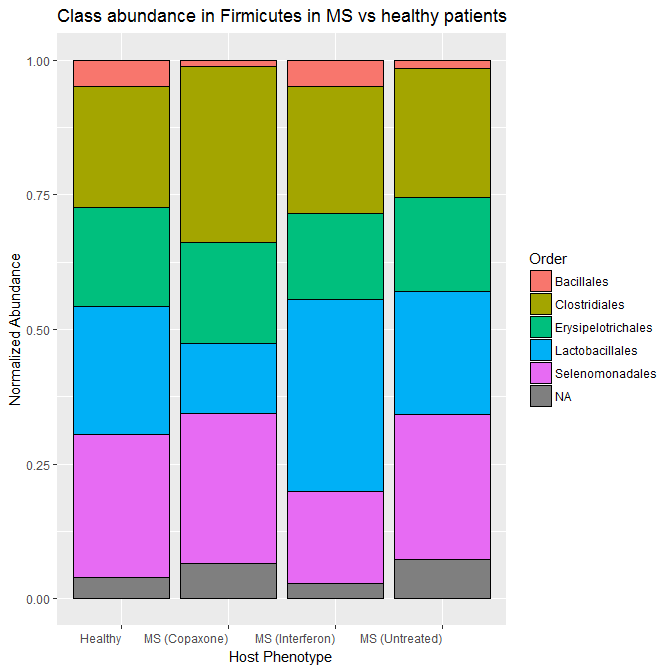

Final Report: The Human Gut Microbiome in Multiple Sclerosis Patients Recieving Various Treatments
================
Emma Gibson
December 14, 2017

Introduction
============

*Background.* In recent years, the human microbiome and its role and function in human health has become a popular topic of study and research. Unlike the harmful pathogens that many associate bacteria with, these microbes live symbiotically on and within our body. For instance, studies have shown that they play a critical role in digestion for numerous eukaryotic organisms, from humans to abalone. (Ley *et al.*, 2008; Erasmus *et al.*, 1997) Although these microbial communities can have vast and numerous affects on their hosts, it was incredibly difficult to study them until recent breakthroughs in DNA sequencing due to their microscopic size and incredible abundance. Now that we have the means to study them, scientists are discovering that their affects on host physiology are profound.

Although the microbes inside our gut are primarily beneficial in nature, these communities have also been linked to countless ailments and diseases, including many autoimmune disorders. (Clemente *et al.*, 2012) While their purpose is complex and still not entirely understood, these gut microbes are known to play a role in training the immune system to recognize and attack potential pathogens both within the gut and throughout the rest of the body. (McDermott and Huffnagle, 2014; Lee and Mazmanian, 2010) Therefore, there is plentiful research being conducted on the role that these microbial communities can play immune system-related disorder both inside the digestive tract and in the body as a whole.

The disorders that are linked tot he microbiome are thought to not be caused by some kind of pathogenesis, but instead by *dysbiosis*. A state of *dysbiosis*, or an abnormal gut microbiome, has already been correlated with numerous disorders, including diabetes, irritable bowel disorder, and rheumatoid arthritis. (Kostic *et al.*, 2014; Alkanani *et al.*, 2015; Scher *et al.*, 2013) In this analysis, I chose to focus on the link between the gut microbiome and multiple sclerosis, another autoimmune disorder that has been linked to dysbiosis. (Cantarel *et al.*, 2015; Chen *et al.*, 2016)

*Study system.* Multiple sclerosis is an autoimmune disease characterized by the immune system's T-cells attacking the myelin coating of nerve cells, causing nerve damage. (Miranda-Hernandez and Baxter, 2013) Symptoms can include pain, motor control issues, sensory issues, and mood issues. Currently, it is unclear what causes the disorder, and studies have found numerous possible causes and risk factors. Some studies have linked its development to environmental factors, such as sunlight exposure and diet. (Riccio *et al.*, 2010) There have also been several possible genetic markers found throughout the human genome. (Oksenberg *et al.*, 2008) Although multiple sclerosis is likely the result of numerous interacting environmental and genetic factors, the gut microbiome can act as an interface for all of these factors, leading to the development of the disease. (Ochoa-Repáraz and Kasper, 2014; Wang and Kasper, 2014)

Like the previously mentioned autoimmune disorders, multiple sclerosis has also been correlated with a state of *dysbiosis*. (Miyake *et al.*, 2015) In evaluating the role that the gut microbiome plays in the development and treatment of diseases such as multiple sclerosis, it is important to note that correlation does not necessarily equal causation. However, a recent study by Berer *et al.* has demonstrated that gut microbes from multiple sclerosis patients can induce multiple sclerosis-like symptoms in transgenic mouse models. (Berer *et al.*, 2017) This indicates that the gut microbiome is not simply an indicator of multiple sclerosis, but plays a role it the development of the disorder as well.

*objectives of this study.* In this analysis, I aim to discover the primary differences between gut microbiomes of multiple sclerosis patients and healthy patients, as well as the differences between different multiple sclerosis treatments. One aspect of this analysis will involve low-resolution analysis of the microbiome community as a whole. I looked at the relative abundances of various bacterial phyla among the different patients, looking for differences in the ratios of one bacterial clade to the other. I also conducted more detailed analysis at several bacterial phyla too see if there are notable trends at the species, genus, or other higher-resolution levels. The main purpose of this study was to discover what trends there are among multiple sclerosis patient and healthy control microbiomes, in both general and detailed terms.

Methods
=======

Study design
------------

The original study by Jangi *et al.* sampled the gut microbiome of 103 individuals, 60 multiple sclerosis patients and 43 healthy controls. (Jangi *et al.*, 2016) There were three variations of multiple sclerosis patients: those with untreated multiple sclerosis, those receiving treatment from beta-interferon (Interferon), and those receiving treatment with glatiramer acetate (Copaxone). Both groups that had been receiving treatment had been doing so for at least 6 months. Both multiple sclerosis and control patients had no antibiotic use in the last 6 months, no probiotic use, no corticosteroids, no history of gastroenteritis, no irritable bowel syndrome, no bowel surgery, no bowel disease, no other autoimmune disease, were not pregnant, and had not traveled outside the country in the past month. All patients were also given a dietary survey before the collection of samples.

Sample origin and sequencing
----------------------------

To obtain microbiome data, Jangi *et al.* used stool samples that were collected by the patients and shipped to the laboratory overnight a 0 degrees Celsius. (Jangi *et al.*, 2016) Upon receiving the samples, they were stored at -80 degrees Celsius until DNA extraction, and were only subjected to one freeze-thaw cycle. They obtained sequence data from the fecal microbes using both Roche 454 pyrosequencing and Illumina MiSeq sequencing of the 16S rRNA gene.

Computational
-------------

I processed and analyzed the sequence data using a combination of bash and R. First, I used bash to download and process the samples in order to determine their length and quality. For this analysis, I only used the pyrosequencing-derived sequences from the original study, because attempting to combine pyrosequencing and Illumina sequencing results would prove troublesome. Before cleaning the sequences, I reformatted some of the metadata, because some of the labels pertaining to patient disease status were inconsistent or contained typos. Although it was still simple rough for a human to understand what the labels meant, they contained minor errors such as spaces and inconsistent capitalization, which would cause trouble for R analysis if not corrected. After correcting these minor metadata errors, I moved on to cleaning and trimming the sequences.

DADA2 was used for inter-sequence analysis and cleaning, such as forming OTUs and resolving minor sequence differences. The DADA2 pipeline begins with filtering paired fastq files by trimming them to a specific length and removing sequences that are too short, then further filtering based on number of expected errors, quality score, and number of ambiguous bases (Callahan *et al.*, 2016). Because I was working with pyrosequencing data that was quite lengthy, I set my maximum sequence length to 700 base pairs. Next, DADA2 can remove chimeras, which are sequences that are mare up of two parent sequences that result from sequencing errors. Lastly, it merges paired forward and reverse reads after all the sequences have been cleaned and de-noised, so that DADA2 can be extremely strict and require exact overlap.

Sequences of sufficient quality were then analyzed in R, using all of the relevant metadata and sequence information. R analyses were conducted through the usage of base R, as well as ggplot, Geneious, and phyloseq. I made some additional analysis by exporting the fasta files derived from DADA2 into Geneious. (Kearse *et al.*, 2012) There, I used the FastTree plugin to construct the phylogenetic tree that went into the phyloseq object. (Price *et al.*, 2009) Phyloseq was used to add various microbiome-specific functions to ggplot in order to better visualize the data (McMurdie and Holmes, 2013).

Results
=======

Ovelall Community Analysis
--------------------------

    ## Warning in estimate_richness(physeq, split = TRUE, measures = measures): The data you have provided does not have
    ## any singletons. This is highly suspicious. Results of richness
    ## estimates (for example) are probably unreliable, or wrong, if you have already
    ## trimmed low-abundance taxa from the data.
    ## 
    ## We recommended that you find the un-trimmed data and retry.

**Figure 1.** Alpha diversity in patients by disease status

This figure shows Shannon diversity in healthy control patients and multiple sclerosis patients receiving each type of treatment. Diversity is relatively similar in all samples regardless of multiple sclerosis status or treatment status. However, the multiple sclerosis groups consistently show a slight increase in diversity, especially in the Copaxone group.

**Table 1.** Phylum abundance in each

This table shows the abundance of each phylum in healthy patients and multiple sclerosis patients of each treatment type. Although the numbers are hard to compare between groups because the patient groups are of different sizes, there are consistencies in which bacterial phyla are the most and least common.

| Phylum                    |  Healthy\_Control|  Multiple\_Sclerosis\_Copaxone|  Multiple\_Sclerosis\_Interferon|  Multiple\_Sclerosis\_Untreated|
|:--------------------------|-----------------:|------------------------------:|--------------------------------:|-------------------------------:|
| Firmicutes                |            206668|                          65758|                            84546|                          136213|
| Bacteroidetes             |             50204|                          15974|                            20538|                           33089|
| Actinobacteria            |              9504|                           3024|                             3888|                            6264|
| Proteobacteria            |              9372|                           2982|                             3834|                            6177|
| Verrucomicrobia           |               836|                            266|                              342|                             551|
| Cyanobacteria/Chloroplast |               440|                            140|                              180|                             290|
| Synergistetes             |               264|                             84|                              108|                             174|
| Euryarchaeota             |               220|                             70|                               90|                             145|
| Fusobacteria              |                88|                             28|                               36|                              58|
| Lentisphaerae             |                44|                             14|                               18|                              29|
| Tenericutes               |                44|                             14|                               18|                              29|

**Table 2.** Number of patients of each treatment type

This table shows the number of patients in each treatment group. Each multiple sclerosis group is smaller on its own than the control group, and the different treatment multiple sclerosis groups are smaller than the untreated multiple sclerosis group. The differences in sample sizes roughly correlate with the total abundances of each phylum. (Table 1) For instance, the ratio of total abundance of Tenericutes among different patient groups is almost identical to the ratio of patient numbers in each group. These discrepancies in sample sized make it necessary to normalize data when taking measurements like sum abundance into account.

| host\_phenotype\_s              |  number\_of\_patients|
|:--------------------------------|---------------------:|
| Healthy\_Control                |                    43|
| Multiple\_Sclerosis\_Copaxone   |                    14|
| Multiple\_Sclerosis\_Interferon |                    18|
| Multiple\_Sclerosis\_Untreated  |                    28|

**Figure 2.** Normalized abundances and standard deviations of each phylum for patients of all types

This figure shows the normalized abundances of each phylum in each treatment group, and their respective standard deviations. (A) shows the normalized abundances of each phylum because the overall sum data is heavily skewed due to diverse sample sized for each test group, which are detailed in Table 2. Although there are several groups of bacteria that retain consistent relative abundance across all patient types, the Interferon-treated multiple sclerosis shows some major differences. Most notably, it contains considerably more Cyanobacteria and less Verrucomicrobia than the other patient groups. (B) shows the normalized standard deviations of each phylum, which remain fairly consistent across patient types. However, once again the Interferon group shows an increased standard deviation among Cyanobacteria and a decreased standard deviation among Verrucomicrobia.

**Figure 3.** Phylogenetic tree colored by patient disease status

This figure shows a phylogenetic tree of all sequences in the data set, with tips colored by patient disease status.Although there are many clear and well-supported clades, the large number of diverse sequences make the tree quite large. At such a broad scope, there are no clear patterns or clades that correlate to patients of one treatment status or another.

Firmicutes Phylum Analysis
--------------------------

**Table 3.** Common classes in Firmicutes bacteria

This table shows the abundances of each class and order within the Firmicutes phylum for multiple sclerosis patients of all disease statuses. Samples whose class could not be determined were excluded. Being one of the most abundant phyla in all samples, there is a large number of classes and orders present in patients of all types. Despite this wide variety of classes, just like with the phylum abundance metrics, the actual sum abundance of each patient type is skewed by its respective sample size.

| Class            | Order              |  Healthy\_Control|  Multiple\_Sclerosis\_Copaxone|  Multiple\_Sclerosis\_Interferon|  Multiple\_Sclerosis\_Untreated|
|:-----------------|:-------------------|-----------------:|------------------------------:|--------------------------------:|-------------------------------:|
| Clostridia       | Clostridiales      |            175472|                          55832|                            71784|                          115652|
| Erysipelotrichia | Erysipelotrichales |             13068|                           4158|                             5346|                            8613|
| Bacilli          | Lactobacillales    |              7348|                           2338|                             3006|                            4843|
| Negativicutes    | Selenomonadales    |              6952|                           2212|                             2844|                            4582|
| Clostridia       | NA                 |               748|                            238|                              306|                             493|
| Bacilli          | Bacillales         |               352|                            112|                              144|                             232|

    ## Warning in estimate_richness(physeq, split = TRUE, measures = measures): The data you have provided does not have
    ## any singletons. This is highly suspicious. Results of richness
    ## estimates (for example) are probably unreliable, or wrong, if you have already
    ## trimmed low-abundance taxa from the data.
    ## 
    ## We recommended that you find the un-trimmed data and retry.

**Figure 4.** Shannon diversity in Firmicutes bacteria

This figure shows the Shannon diversity in all bacteria within the Firmicutes phylum for patients of all disease statuses. The diversity patterns within this phylum more or less reflect the diversity of the overall data. That said, there appears to be a slightly higher amount of variability within the diversity for each patient type within this phylum than in the overall community data.

**Figure 5.** Phylogenetic tree of Firmicutes bacteria

This figure shows a phylogenetic tree of all sequences in the Firmicutes phylum, with tips colored by patient disease status. While there are several prominent clades, there are no clear patterns where one clade contains predominantly patients of a certain treatment or disease status. As with the overall community analysis, this phylum appears to contain too many diverse sequences to construct a detailed phylogenetic tree.

**Figure 10.** Normalized abundances of each order within Firmicutes for patients of each treatment type

This figure shows the normalized relative abundances of each order within Firmicutes. Most notable trends include the reduction of Bacillales in Copaxone-treated and untreated multiple sclerosis patients, a decrease in Lactobacillales in Copaxone patients, and an increase in Lactobacillales in Interferon-treated MS patients.

Cyanobacteria Community Analysis
--------------------------------

**Table 4.** Common class in Cyanobacteria

This table shows the class of Cyanobacteria samples for multiple sclerosis patients of all disease statuses. Samples whose class could not be determined were not included. All samples were identified to be from the same class, Chloroplast, across both healthy controls and patients of all disease statuses.

| Class       |  Healthy\_Control|  Multiple\_Sclerosis\_Copaxone|  Multiple\_Sclerosis\_Interferon|  Multiple\_Sclerosis\_Untreated|
|:------------|-----------------:|------------------------------:|--------------------------------:|-------------------------------:|
| Chloroplast |               440|                            140|                              180|                             290|

    ## Warning in estimate_richness(physeq, split = TRUE, measures = measures): The data you have provided does not have
    ## any singletons. This is highly suspicious. Results of richness
    ## estimates (for example) are probably unreliable, or wrong, if you have already
    ## trimmed low-abundance taxa from the data.
    ## 
    ## We recommended that you find the un-trimmed data and retry.

**Figure 6.** Shannon diversity in Cyanobacteria

This figure shows the Shannon diversity in all bacteria within the Cyanobacteria phylum for patients of all disease statuses. There is almost no diversity in any of the samples, which is reflected in Table 4, that shows there is only one class within this phylum. There is one outlier, which is within the patients being treated with Interferon. This is the same disease status group that showed an increase in Cyanobacteria (Figure 2)

**Figure 7.** Phylogenetic tree of Cyanobacteria

This figure shows a phylogenetic tree of all sequences in the Cyanobacteria phylum, with tips colored by patient disease status. There are two major well-supported clades, one that contains primarily Cyanobacteria from healthy patients, and one that contains exclusively multiple sclerosis patients.

Verrucomicrobia Phylum Analysis
-------------------------------

**Table 5.** Common class, order, family, and genus in Verrucomicrobia bacteria

This table shows the class, order, family, and genus among Verrucomicrobia samples for multiple sclerosis patients of all disease statuses. Samples whose class could not be determined were not included. All samples were identified to be from the same class, order, family, and genus across both healthy controls and patients of all disease statuses.

| Class            | Order              | Family              | Genus       |  Healthy\_Control|  Multiple\_Sclerosis\_Copaxone|  Multiple\_Sclerosis\_Interferon|  Multiple\_Sclerosis\_Untreated|
|:-----------------|:-------------------|:--------------------|:------------|-----------------:|------------------------------:|--------------------------------:|-------------------------------:|
| Verrucomicrobiae | Verrucomicrobiales | Verrucomicrobiaceae | Akkermansia |               836|                            266|                              342|                             551|

    ## Warning in estimate_richness(physeq, split = TRUE, measures = measures): The data you have provided does not have
    ## any singletons. This is highly suspicious. Results of richness
    ## estimates (for example) are probably unreliable, or wrong, if you have already
    ## trimmed low-abundance taxa from the data.
    ## 
    ## We recommended that you find the un-trimmed data and retry.

**Figure 8.** Shannon diversity in Verrucomicrobia bacteria

This figure shows the Shannon diversity in all bacteria within the Verrucomicrobia phylum for patients of all disease statuses. There is almost no diversity in any of the samples, which is reflected in Table 5, that shows all of the bacteria in this phylum belongs to the same class, order, family, and genus.

**Figure 9.** Phylogenetic tree of Verrucomicrobia

This figure shows a phylogenetic tree of all sequences in the Verrucomicrobia phylum, with tips colored by patient disease status. There are no obvious clades within this tree, dominated by one patient types or otherwise. In addition, all of the tips are very short, indicating that all of the sequences in this data set are fairly similar and reinforcing the fact that there is little diversity within this phylum. (Figure 8)

Discussion
==========

Overall Community Analysis
--------------------------

The differences in overall diversity between multiple sclerosis patients and the healthy controls were somewhat negligible, although all multiple sclerosis groups showed slightly higher diversity than the control patients. (Figure 1) The reason for this increased diversity is unclear based on my analysis, so further study would be needed to investigate this completely. One possible explanation could be that multiple sclerosis is cause by the presence of harmful bacteria, rather than the absence of beneficial ones. However, the correlation is not strong enough to draw any significant conclusions from. When looking at the overall abundance of each phylum in the patients, it is important to remember that the various sample sizes will influence the overall sum abundance. (Table 2) Keeping hat in mind, it is still apparent that the most common bacteria in multiple sclerosis patients are the same as those in healthy patients, such as the Firmicutes and Bacteriodetes phyla. Given that these are generally considered the most common phyla in the human gut, this is not surprising. (Turnbaugh *et al.*, 2009)

That said, there did appear to be significant differences in community composition between the control patients, as well as between patients receiving different treatment types. (Figure 2 A) Most notably, patients receiving Interferon treatment for their multiple sclerosis have a lower abundance of Verrucomicrobia and a higher abundance of Cyanobacteria. (Figure 2 A) This abundance of Cyanobacteria is particularly strange, because according to phyloseq, the Cyanobacteria in question all belong to the Chloroplast class. This raises the question of what chloroplasts were doing in the dark environment of the human intestine, and why Interferon apparently raised their abundance. This increased abundance is likely not an accident due to an outlier, because the standard deviation for Cyanobacteria abundance in Interferon patients is relatively similar to that of similarly abundant phyla. (Figure 2 B)

Although he phylogenetic tree of the overall microbiome data shows numerous clades but no correlation between disease status and phylogeny, it is too large to draw any detailed conclusions from. (Figure 3) The vast number of sequences in this microbiome data makes it impossible to determine any meaningful phylogenetic patterns at the entire-community level, because it contains so many different species. Therefore, I turned to smaller, phylum-specific analysis to draw more detailed conclusions.

Firmicutes Community Analysis
-----------------------------

The first phylum I looked at in-depth was Firmicutes, because it had one of the highest abundances in both the control group and all multiple sclerosis patients. (Table 1) Although there are many different species within this phylum present in the patients, there is no particular class, order, or family that is absent or present in one group of patients. (Table 3) This indicates that either the difference in Firmicutes microbiome content between multiple sclerosis and healthy patients is only apparent on the genus or species level, or there is no major difference for this phylum in multiple sclerosis patient's gut microbiomes. Based on previous studies, I suspect that it is the former, and the gut microbiome associated with multiple sclerosis within this class are only observable at smaller taxonomic levels. (Miyake *et al.*, 2015)

In order to reach this conclusion, the next analysis I did was to find the Shannon diversity within the Firmicutes phylum. The analysis showed that the Shannon diversity within this phylum more or less mimicked the overall diversity for each patient type. (Figure 4) This makes sense, given that Firmicutes is the most common phylum and therefore likely accounts for most of the diversity in each patient type.

The next method I used to analyze the Firmicutes class was the phylogenetic tree of only bacterium in the Firmicutes phylum. While there are several distinct clades in this phylogegetic tree, all of them appear to contain samples from patients in each disease type. (Figure 5) Given that Firmicutes is one of the most abundant phyla in the human gut, these findings seem to indicate that the Firmicutes bacteria present in multiple sclerosis patients' guts play the same basic role as those in a healthy person's gut. (Turnbaugh *et al.*, 2009) That said,, it is possible that while a majority of Firmicutes play the same role in healthy controls and MS patients, there may be certain classes, or orders that are different within each patient type.

Therefore, my final analysis of the Firmicutes class was to look at the relative abundances of each Order within it. I cound that even at this level, the relative abundances were relatively similar across patient types, with a few variations. (Figure 10) Interestingly, the Lactobacillales appear to be less abundant than the control in the Copaxone treatment group, more abundant among the Interferon treatment group, and equally abundant among the Untreated group. Although it a strange occurrence, I think it has more to do with the drugs' side effects rather than the treatment of the disease, there is no difference in this order between the untreated and control groups. I think that this analysis indicates that any differences within the Firmicutes phylum are on a more specific taxonomic level than even Order.

Verrucomicrobia Community Analysis
----------------------------------

The next phylum I looked at was Verrucomicrobia, because it was very abundant in every patient group except for the Interferon-treated multiple sclerosis patients. (Figure 2 A) Just like Cyanobacteria, there is significantly lower Shannon diversity in Verrucomicrobia in patients of every sample, which makes sense because it is also less common. (Figure 8) However, unlike Cyanobacteria, there does not appear to be a significant phylogenetic difference between Verrucomicrobia in multiple sclerosis and healthy patients. (Figure 9) The lack of diversity in this phylum both between and within multiple sclerosis patient sand healthy individuals indicates that it is likely not important to the development or treatment of multiple sclerosis. That said, the analysis I performed did not explain why its abundance appears to be so much lower in Interferon-treated multiple sclerosis patients than the other groups.

The original paper by Jangi *et al.* also found that there was an increase in Verrucomicrobia in multiple sclerosis patients compared to healthy controls. (Jangi *et al.*, 2016) However, they did not divide the two treatment groups into two separate categories, and found that the average abundance between Copaxone and Interferon-treated multiple sclerosis patients is similar to the abundance in healthy patients. Although this is true, looking at the to treatments individually reveals that the average only appears this way because one group has much less Verrucomicrobia than the control, and one has slightly more. I think that my additional analysis indicates that the two treatment methods address different aspects of multiple sclerosis.

Cyanobacteria Community Analysis
--------------------------------

The last phylum I looked at in-depth was Cyanobacteria, both because it seemed to have different abundance patterns, and because it seemed like an odd bacterium to find inside a human gut. This struck me as peculiar, because Cyanobacteria is well-known as a photosynthetic phylum that needs light in order to complete its cellular processes. If this is the case then what would it be dong in the dark environment of the human intestine? Although this could be attributed to contamination or identification error, this seems unlikely because every patient type contains some amount of this phylum. (Figure 3 A) A more likely explanation could be that the DNA came from plant matter that the patients ate, which is supported by the fact that the Cyanobacteria sequences all appear to be from the Chloroplast class. (Table 4) However, this possibility does not explain why the Cyanobacteria form two distinct, somewhat well-supported clades that differ between multiple sclerosis patients and healthy controls. (Figure 7) Unless the multiple sclerosis patients were all eating the same plant material, and said plant material was different from that which the healthy controls were eating, this observation would mot make sense. Because of this, I think it is not unreasonable to infer that the Cyanobacteria were in fact living inside the patients' guts. Therefore, the following analysis assumes that the Cyanobacteria sequences *are* symbiotes living in the patients' digestive tracts, and not from plant matter they had consumed.

Initially, it appears that patients in the Interferon-treated multiple sclerosis group appeared to have a greater abundance of this phylum than the other groups. (Figure 2 A) That said, this could be due to an outlier within the Interferon group, as this group shows a greater standard deviation among Cyanobacteria than the other groups. (Figure 2 B) This fact observation being due to an outlier is further supported by the diversity metrics within this phylum, which shows one Interferon patient with significantly higher Shannon diversity than the other groups. (Figure 6) Interestingly, all of the Cyanobacteria appeared to be from the same class, Chloroplast. (Table 4) As one might expect from this information, the alpha diversity within this phylum was subsequently low among all individuals, including Interferon-treated multiple sclerosis patients. (Figure 6) Measuring diversity alone, it might appear that Cyanobacteria has little impact on the pathogenesis of multiple sclerosis. That said, these diversity measures only account for diversity within patients of the same disease status, and looking at the genetic trends within patient types reveals a different trend.

Phylogenetic analysis indicates that even if the abundance and diversity of Cyanobacteria is not significantly different within the same categories of multiple sclerosis patients and healthy controls, this phylum still may play a role in the disorder. The phylogenetic analysis shows a more meaningful difference between the Cyanobacteria in healthy and multiple sclerosis patients. This tree showed two main clades, one that primarily contained Cyanobacteria from healthy patients and another that contained Cyanobacteria exclusively from multiple sclerosis patients. (Figure 7) This indicates that while there is little diversity in Cyanobacteria within patient groups, the Cyanobacteria found in multiple sclerosis patients appears to be genetically different than that in healthy patients. This indicates that there is a difference in the Cyanobacteria contents of gut microbiomes between multiple sclerosis and healthy patients, and possibly a connection between this phylum and the development or treatment of multiple sclerosis.

If there is Cyanobacteria plays a significant role in the development of multiple sclerosis, the next step in understanding this role would be to figure out the mechanism through which it does so. One study links multiple sclerosis to a phage that is known to infect certain species of Cyanobacteria. (Carter, 2012) Given this information, I think it is possible that the Cyanobacteria in these multiple sclerosis patients may be somehow related to this virus. One possibility is that these strains are somehow more susceptible to the virus, causing multiple sclerosis patients' Cyanobacteria strains to become infected while healthy controls' Cyanobacteria to remain uninfected. Another possibility is what the Cyanobacteria in multiple sclerosis patients have incorporated viral DNA into their genome or as a plasmid, although this might not be evident in a 16S sample. I think it would be interesting to perform a more in-depth study on the Cyanobacteria in these patients' gut microbiomes, possibly looking for viral genetic markers or other, more Cyanobacteria-specific amplicons.

Sources Cited
=============

Alkanani,A.K. *et al.* (2015) Alterations in intestinal microbiota correlate with susceptibility to type 1 diabetes. *Diabetes*, **64**, 3510–3520.

Berer,K. *et al.* (2017) Gut microbiota from multiple sclerosis patients enables spontaneous autoimmune encephalomyelitis in mice. *Proceedings of the National Academy of Sciences*, 201711233.

Callahan,B.J. *et al.* (2016) DADA2: High-resolution sample inference from illumina amplicon data. *Nature Methods*, **13**, 581–583.

Cantarel,B. *et al.* (2015) Gut microbiota in multiple sclerosis: Possible influence of immunomodulators. *Journal of investigative medicine: the official publication of the American Federation for Clinical Research*, **63**, 729–734.

Carter,C. (2012) Epstein–Barr and other viral mimicry of autoantigens, myelin and vitamin d-related proteins and of eif2b, the cause of vanishing white matter disease: Massive mimicry of multiple sclerosis relevant proteins by the synechococcus phage. *Immunopharmacology and immunotoxicology*, **34**, 21–35.

Chen,J. *et al.* (2016) Multiple sclerosis patients have a distinct gut microbiota compared to healthy controls. *Scientific reports*, **6**, 28484.

Clemente,J.C. *et al.* (2012) The impact of the gut microbiota on human health: An integrative view. *Cell*, **148**, 1258–1270.

Erasmus,J.H. *et al.* (1997) The role of bacteria in the digestion of seaweed by the abalone haliotis midae. *Aquaculture*, **155**, 377–386.

Jangi,S. *et al.* (2016) Alterations of the human gut microbiome in multiple sclerosis. *Nature communications*, **7**.

Kearse,M. *et al.* (2012) Geneious basic: An integrated and extendable desktop software platform for the organization and analysis of sequence data. *Bioinformatics*, **28**, 1647–1649.

Kostic,A.D. *et al.* (2014) The microbiome in inflammatory bowel disease: Current status and the future ahead. *Gastroenterology*, **146**, 1489–1499.

Lee,Y.K. and Mazmanian,S.K. (2010) Has the microbiota played a critical role in the evolution of the adaptive immune system? *Science*, **330**, 1768–1773.

Ley,R.E. *et al.* (2008) Evolution of mammals and their gut microbes. *Science*, **320**, 1647–1651.

McDermott,A.J. and Huffnagle,G.B. (2014) The microbiome and regulation of mucosal immunity. *Immunology*, **142**, 24–31.

McMurdie,P.J. and Holmes,S. (2013) Phyloseq: An r package for reproducible interactive analysis and graphics of microbiome census data. *PLoS ONE*, **8**, e61217.

Miranda-Hernandez,S. and Baxter,A.G. (2013) Role of toll-like receptors in multiple sclerosis. *American journal of clinical and experimental immunology*, **2**, 75.

Miyake,S. *et al.* (2015) Dysbiosis in the gut microbiota of patients with multiple sclerosis, with a striking depletion of species belonging to clostridia xiva and iv clusters. *PLoS One*, **10**, e0137429.

Ochoa-Repáraz,J. and Kasper,L.H. (2014) Gut microbiome and the risk factors in central nervous system autoimmunity. *FEBS letters*, **588**, 4214–4222.

Oksenberg,J.R. *et al.* (2008) The genetics of multiple sclerosis: SNPs to pathways to pathogenesis. *Nature Reviews Genetics*, **9**, 516–526.

Price,M.N. *et al.* (2009) FastTree: Computing large minimum evolution trees with profiles instead of a distance matrix. *Molecular Biology and Evolution*, **26**, 1641–1650.

Riccio,P. *et al.* (2010) May diet and dietary supplements improve the wellness of multiple sclerosis patients? A molecular approach. *Autoimmune diseases*, **2010**.

Scher,J.U. *et al.* (2013) Expansion of intestinal prevotella copri correlates with enhanced susceptibility to arthritis. *Elife*, **2**, e01202.

Turnbaugh,P.J. *et al.* (2009) A core gut microbiome in obese and lean twins. *nature*, **457**, 480–484.

Wang,Y. and Kasper,L.H. (2014) The role of microbiome in central nervous system disorders. *Brain, Behavior, and Immunity*, **38**, 1–12.
