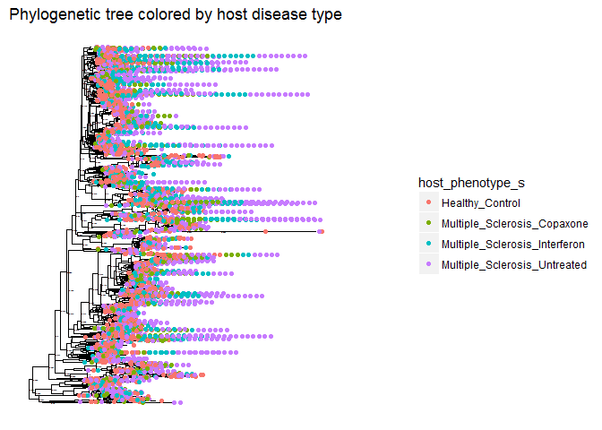

Final Report: Your Title Here
================
Don Francisco
November 22, 2017

Introduction
============

Add about 2-3 pages here. Across the whole manuscript, you should cite at least 20 peer reviewed articles.

Methods
=======

Study design
------------

Add about half a page here. In this section instead of first person (I/we), use the authors of the paper you selected, since you'll just be describing what they did, based on the methods in their paper.

Sample origin and sequencing
----------------------------

Add about half a page here. In this section instead of first person (I/we), use the authors of the paper you selected, since you'll just be describing what they did, based on the methods in their paper.

Computational
-------------

These are the methods you used to do your bioinformatic analyses analyses. Should probably be between 0.5 and 1 pages. At a very minimum should include citations for DADA2 and phyloseq if you are doing an amplicon study, or other citations as appropriate.

Results
=======

Subsections are ok in the results section too
---------------------------------------------

``` r
# load all necesary libraries
library("dplyr")
```

    ## 
    ## Attaching package: 'dplyr'

    ## The following objects are masked from 'package:stats':
    ## 
    ##     filter, lag

    ## The following objects are masked from 'package:base':
    ## 
    ##     intersect, setdiff, setequal, union

``` r
library("tidyr")
library("knitr")
library("ggplot2")
library("vegan")
```

    ## Loading required package: permute

    ## Loading required package: lattice

    ## This is vegan 2.4-4

``` r
library("RColorBrewer")
library("citr")
library("seqinr")
```

    ## 
    ## Attaching package: 'seqinr'

    ## The following object is masked from 'package:permute':
    ## 
    ##     getType

    ## The following object is masked from 'package:dplyr':
    ## 
    ##     count

``` r
library("mctoolsr")
```

    ## You're using mctoolsr (v.0.1.1.1). Direct inquiries to:
    ## 'https://github.com/leffj/mctoolsr'

``` r
library("phyloseq")
```

    ## 
    ## Attaching package: 'phyloseq'

    ## The following object is masked from 'package:mctoolsr':
    ## 
    ##     plot_ordination

``` r
# load the output of the DADA2 script
load("output/phyloseq_obj.RData")
seq_table <- read.table("output/sequence_variants_table.txt",
                        row.names = 1,
                        header = TRUE)
metadata_in <- read.table(paste0("data/metadata/",
                                 "SraRunTable.txt"),
                          sep = "\t",
                          header = TRUE,
                          stringsAsFactors = FALSE,
                          row.names = 13)
# Melt phyloseq object to make certain analysis easier
melted_obj <- psmelt(phyloseq_obj)
```

``` r
# this subset removes mouse data from the dataset
plot_richness(phyloseq_obj,
              x = "host_phenotype_s",
              measures = c("Shannon")) +
  xlab("Host Disease Status") +
  geom_boxplot(aes(fill = host_phenotype_s),
               width = 0.2) +
  ggtitle("Alpha diversity in MS versus healthy patients")
```

    ## Warning in estimate_richness(physeq, split = TRUE, measures = measures): The data you have provided does not have
    ## any singletons. This is highly suspicious. Results of richness
    ## estimates (for example) are probably unreliable, or wrong, if you have already
    ## trimmed low-abundance taxa from the data.
    ## 
    ## We recommended that you find the un-trimmed data and retry.


``` r
# this code plots the abundance of each phylum present in each sex's hands
phylum_totals <- melted_obj %>%
  filter(!is.na(Phylum)) %>%
  group_by(Phylum, host_phenotype_s) %>%
  tally() %>%
  spread(key = host_phenotype_s,
         value = n) %>%
  arrange(desc(Healthy_Control), desc(Multiple_Sclerosis_Interferon),
          desc(Multiple_Sclerosis_Copaxone), desc(Multiple_Sclerosis_Untreated))
kable(phylum_totals)
```

| Phylum                    |  Healthy\_Control|  Multiple\_Sclerosis\_Copaxone|  Multiple\_Sclerosis\_Interferon|  Multiple\_Sclerosis\_Untreated|
|:--------------------------|-----------------:|------------------------------:|--------------------------------:|-------------------------------:|
| Firmicutes                |            206668|                          65758|                            84546|                          136213|
| Bacteroidetes             |             50204|                          15974|                            20538|                           33089|
| Actinobacteria            |              9504|                           3024|                             3888|                            6264|
| Proteobacteria            |              9372|                           2982|                             3834|                            6177|
| Verrucomicrobia           |               836|                            266|                              342|                             551|
| Cyanobacteria/Chloroplast |               440|                            140|                              180|                             290|
| Synergistetes             |               264|                             84|                              108|                             174|
| Euryarchaeota             |               220|                             70|                               90|                             145|
| Fusobacteria              |                88|                             28|                               36|                              58|
| Lentisphaerae             |                44|                             14|                               18|                              29|
| Tenericutes               |                44|                             14|                               18|                              29|

``` r
melted_obj %>%
  group_by(host_phenotype_s) %>%
  summarise(number_of_patients = n_distinct(isolate_s))
```

    ## # A tibble: 4 x 2
    ##                host_phenotype_s number_of_patients
    ##                           <chr>              <int>
    ## 1               Healthy_Control                 43
    ## 2   Multiple_Sclerosis_Copaxone                 14
    ## 3 Multiple_Sclerosis_Interferon                 18
    ## 4  Multiple_Sclerosis_Untreated                 28

``` r
# this makes a stacked bar plot with phylum relative abundances
# for each type of patient
melted_obj %>%
  filter(!is.na(Phylum)) %>%
  group_by(host_phenotype_s, Phylum) %>%
  summarize(mean_abund = mean(Abundance)) %>%
  ggplot(aes(x = host_phenotype_s,
             y = mean_abund,
             fill = Phylum)) +
    geom_col(position = "fill",
             color = "black") +
  #scale_x_discrete(labels = c("a", "b", "c", "d")) +
  theme(axis.text.x = element_text(angle = 45, hjust = 1))
```


``` r
melted_obj %>%
  filter(!is.na(Phylum)) %>%
  group_by(host_phenotype_s, Phylum) %>%
  summarize(sd_abund = sd(Abundance)) %>%
  ggplot(aes(x = host_phenotype_s,
             y = sd_abund,
             fill = Phylum)) +
    geom_col(position = "fill",
             color = "black") +
  #scale_x_discrete(labels = c("a", "b", "c", "d")) +
  theme(axis.text.x = element_text(angle = 45, hjust = 1))
```


``` r
#this code displays the phylogenetic tree from 
plot_tree(phyloseq_obj,
          color = "host_phenotype_s",
          ladderize = TRUE) +
# the last line arranges the tree branches from short to long
  ggtitle("A. Phylogenetic tree colored by host ID")
```


``` r
# you can use prune_taxa to look at trees for certain taxa
```

``` r
firm_classes <- melted_obj %>%
  filter(Phylum == "Firmicutes") %>%
  filter(!is.na(Class)) %>%
  group_by(host_phenotype_s, Class, Order, Family) %>%
  tally() %>%
  spread(key = host_phenotype_s,
         value = n) %>%
  arrange(desc(Healthy_Control), desc(Multiple_Sclerosis_Interferon),
          desc(Multiple_Sclerosis_Copaxone), desc(Multiple_Sclerosis_Untreated))
kable(firm_classes)
```

| Class            | Order              | Family                               |  Healthy\_Control|  Multiple\_Sclerosis\_Copaxone|  Multiple\_Sclerosis\_Interferon|  Multiple\_Sclerosis\_Untreated|
|:-----------------|:-------------------|:-------------------------------------|-----------------:|------------------------------:|--------------------------------:|-------------------------------:|
| Clostridia       | Clostridiales      | Lachnospiraceae                      |             78320|                          24920|                            32040|                           51620|
| Clostridia       | Clostridiales      | Ruminococcaceae                      |             70752|                          22512|                            28944|                           46632|
| Erysipelotrichia | Erysipelotrichales | Erysipelotrichaceae                  |             13068|                           4158|                             5346|                            8613|
| Clostridia       | Clostridiales      | NA                                   |             12320|                           3920|                             5040|                            8120|
| Bacilli          | Lactobacillales    | Streptococcaceae                     |              5148|                           1638|                             2106|                            3393|
| Negativicutes    | Selenomonadales    | Veillonellaceae                      |              4664|                           1484|                             1908|                            3074|
| Clostridia       | Clostridiales      | Peptostreptococcaceae                |              4136|                           1316|                             1692|                            2726|
| Clostridia       | Clostridiales      | Clostridiales\_Incertae\_Sedis\_XIII |              4048|                           1288|                             1656|                            2668|
| Negativicutes    | Selenomonadales    | Acidaminococcaceae                   |              2156|                            686|                              882|                            1421|
| Clostridia       | Clostridiales      | Clostridiaceae\_1                    |              2068|                            658|                              846|                            1363|
| Clostridia       | Clostridiales      | Eubacteriaceae                       |              1584|                            504|                              648|                            1044|
| Bacilli          | Lactobacillales    | Lactobacillaceae                     |              1276|                            406|                              522|                             841|
| Clostridia       | Clostridiales      | Christensenellaceae                  |               924|                            294|                              378|                             609|
| Clostridia       | NA                 | NA                                   |               748|                            238|                              306|                             493|
| Clostridia       | Clostridiales      | Peptococcaceae\_1                    |               660|                            210|                              270|                             435|
| Bacilli          | Bacillales         | Bacillales\_Incertae\_Sedis\_XI      |               352|                            112|                              144|                             232|
| Clostridia       | Clostridiales      | Gracilibacteraceae                   |               308|                             98|                              126|                             203|
| Bacilli          | Lactobacillales    | Carnobacteriaceae                    |               264|                             84|                              108|                             174|
| Bacilli          | Lactobacillales    | Leuconostocaceae                     |               264|                             84|                              108|                             174|
| Bacilli          | Lactobacillales    | Enterococcaceae                      |               220|                             70|                               90|                             145|
| Clostridia       | Clostridiales      | Peptoniphilaceae                     |               176|                             56|                               72|                             116|
| Bacilli          | Lactobacillales    | NA                                   |               132|                             42|                               54|                              87|
| Clostridia       | Clostridiales      | Catabacteriaceae                     |               132|                             42|                               54|                              87|
| Negativicutes    | Selenomonadales    | NA                                   |               132|                             42|                               54|                              87|
| Bacilli          | Lactobacillales    | Aerococcaceae                        |                44|                             14|                               18|                              29|
| Clostridia       | Clostridiales      | Clostridiales\_Incertae\_Sedis\_XI   |                44|                             14|                               18|                              29|

``` r
fir_subset <- subset_taxa(phyloseq_obj, Phylum == "Firmicutes")
# this subset removes mouse data from the dataset
plot_richness(fir_subset,
              x = "host_phenotype_s",
              measures = c("Shannon")) +
  xlab("Host Disease Status") +
  geom_boxplot(aes(fill = host_phenotype_s),
               width = 0.2) +
  ggtitle("Alpha diversity  of Firmicutes in MS versus healthy patients")
```

    ## Warning in estimate_richness(physeq, split = TRUE, measures = measures): The data you have provided does not have
    ## any singletons. This is highly suspicious. Results of richness
    ## estimates (for example) are probably unreliable, or wrong, if you have already
    ## trimmed low-abundance taxa from the data.
    ## 
    ## We recommended that you find the un-trimmed data and retry.


``` r
plot_tree(fir_subset,
     color = "host_phenotype_s")
```



``` r
cy_class <- melted_obj %>%
  filter(Phylum == "Cyanobacteria/Chloroplast") %>%
  group_by(host_phenotype_s, Class) %>%
  tally() %>%
  spread(key = host_phenotype_s,
         value = n) %>%
  arrange(desc(Healthy_Control), desc(Multiple_Sclerosis_Interferon),
          desc(Multiple_Sclerosis_Copaxone), desc(Multiple_Sclerosis_Untreated))
kable(cy_class)
```

| Class       |  Healthy\_Control|  Multiple\_Sclerosis\_Copaxone|  Multiple\_Sclerosis\_Interferon|  Multiple\_Sclerosis\_Untreated|
|:------------|-----------------:|------------------------------:|--------------------------------:|-------------------------------:|
| Chloroplast |               440|                            140|                              180|                             290|

``` r
cy_subset <- subset_taxa(phyloseq_obj, Phylum == "Cyanobacteria/Chloroplast")
# this subset removes mouse data from the dataset
plot_richness(cy_subset,
              x = "host_phenotype_s",
              measures = c("Shannon")) +
  xlab("Host Disease Status") +
  geom_boxplot(aes(fill = host_phenotype_s),
               width = 0.2) +
  ggtitle("Alpha diversity of Cyanobacteria in MS versus healthy patients")
```

    ## Warning in estimate_richness(physeq, split = TRUE, measures = measures): The data you have provided does not have
    ## any singletons. This is highly suspicious. Results of richness
    ## estimates (for example) are probably unreliable, or wrong, if you have already
    ## trimmed low-abundance taxa from the data.
    ## 
    ## We recommended that you find the un-trimmed data and retry.


``` r
plot_tree(cy_subset,
     color = "host_phenotype_s")
```


``` r
ver_classes <- melted_obj %>%
  filter(Phylum == "Verrucomicrobia") %>%
  group_by(host_phenotype_s, Class, Order, Family, Genus) %>%
  tally() %>%
  spread(key = host_phenotype_s,
         value = n) %>%
  arrange(desc(Healthy_Control), desc(Multiple_Sclerosis_Interferon),
          desc(Multiple_Sclerosis_Copaxone), desc(Multiple_Sclerosis_Untreated))
kable(ver_classes)
```

| Class            | Order              | Family              | Genus       |  Healthy\_Control|  Multiple\_Sclerosis\_Copaxone|  Multiple\_Sclerosis\_Interferon|  Multiple\_Sclerosis\_Untreated|
|:-----------------|:-------------------|:--------------------|:------------|-----------------:|------------------------------:|--------------------------------:|-------------------------------:|
| Verrucomicrobiae | Verrucomicrobiales | Verrucomicrobiaceae | Akkermansia |               836|                            266|                              342|                             551|

``` r
ver_subset <- subset_taxa(phyloseq_obj, Phylum == "Verrucomicrobia")
# this subset removes mouse data from the dataset
plot_richness(ver_subset,
              x = "host_phenotype_s",
              measures = c("Shannon")) +
  xlab("Host Disease Status") +
  geom_boxplot(aes(fill = host_phenotype_s),
               width = 0.2) +
  ggtitle("Alpha diversity of Verrucomicrobia in MS versus healthy patients")
```

    ## Warning in estimate_richness(physeq, split = TRUE, measures = measures): The data you have provided does not have
    ## any singletons. This is highly suspicious. Results of richness
    ## estimates (for example) are probably unreliable, or wrong, if you have already
    ## trimmed low-abundance taxa from the data.
    ## 
    ## We recommended that you find the un-trimmed data and retry.


``` r
plot_tree(ver_subset,
     color = "host_phenotype_s")
```

 In addition to a minimum of 5-10 figures/tables (and associated captions), you should include sufficient text in this section to describe what your findings were. Remember that in the results section you just describe what you found, but you don't interpret it - that happens in the discussion. 2-3 pages.

Discussion
==========

Add around 3-4 pages interpreting your results and considering future directions one might take in analyzing these data.

Sources Cited
=============
