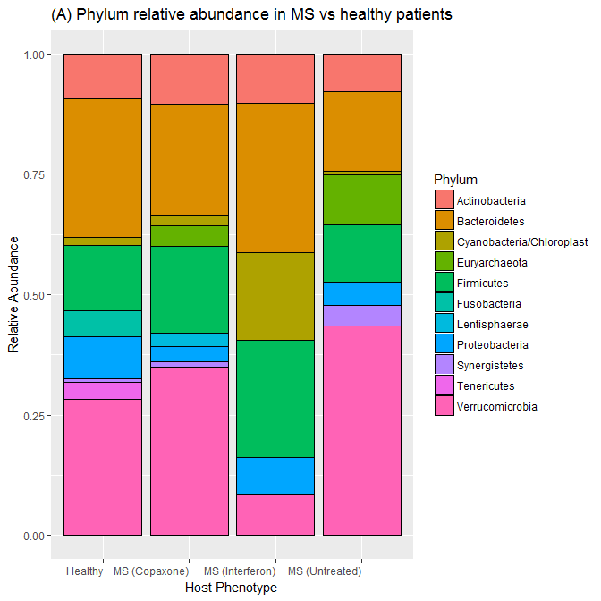

Final Report: The Human Gut Microbiome in Multiple Sclerosis Patients Recieving Various Treatments
================
Emma Gibson
December 14, 2017

Introduction
============

*Background.* In recent years, the human microbiome and its role and function in human health has become a popular topic of study and research. Unlike the harmful pathogens that bacteria are commonly assumed to be, these microbes live symbiotically on and within our body. For instance, studies have shown that they play a critical role in digestion for numerous eukaryotic organisms, from humans to abalone (Ley *et al.*, 2008; Erasmus *et al.*, 1997). Although these microbial communities can have vast and numerous affects on their hosts, it was incredibly difficult to study them until recent breakthroughs in DNA sequencing due to their microscopic size and incredible abundance. Now that we have the means to study them, scientists are discovering that their effects on host physiology are numerous and profound.

Although the microbes inside our gut are primarily beneficial in nature, these communities have also been linked to countless ailments and diseases, including many autoimmune disorders (Clemente *et al.*, 2012). While their purpose is complex and still not entirely understood, gut microbes are known to play a role in training the immune system to recognize and attack potential pathogens both within the gut and throughout the rest of the body (McDermott and Huffnagle, 2014; Lee and Mazmanian, 2010). In theory, this means that an abnormal microbiome could potentially lead to a poorly-trained immune system and thereby contribute to autoimmune disorders. Therefore, there is plentiful research being conducted on the role that these microbial communities both inside the digestive tract and elsewhere in the body can play immune system-related disorders.

The disorders that are linked to the microbiome are thought to not be caused by some kind of pathogenesis, but instead by *dysbiosis*. A state of *dysbiosis*, or an abnormal gut microbiome, has already been correlated with numerous disorders, including certain types of diabetes, irritable bowel disorder, and rheumatoid arthritis (Kostic *et al.*, 2014; Alkanani *et al.*, 2015; Scher *et al.*, 2013). In this analysis, I chose to focus on the link between the gut microbiome and multiple sclerosis, another autoimmune disorder that has been linked to dysbiosis (Cantarel *et al.*, 2015; Chen *et al.*, 2016).

*Study system.* Multiple sclerosis is an autoimmune disease characterized by the immune system's T-cells attacking the myelin coating of nerve cells, causing nerve damage (Miranda-Hernandez and Baxter, 2013). Symptoms can include pain, motor control issues, sensory issues, and mood issues. Currently, it is unclear what causes the disorder, and studies have found numerous possible causes and risk factors. Some studies have linked its development to environmental factors, such as sunlight exposure and diet (Riccio *et al.*, 2010). There have also been several possible genetic markers found throughout the human genome (Oksenberg *et al.*, 2008). Although multiple sclerosis is likely the result of numerous interacting environmental and genetic factors, the gut microbiome can act as an interface for all of these factors, leading to the development of the disease (Ochoa-Repáraz and Kasper, 2014; Wang and Kasper, 2014).

Like the previously mentioned autoimmune disorders, multiple sclerosis has been correlated with a state of *dysbiosis* (Miyake *et al.*, 2015). In evaluating the role that the gut microbiome plays in the development and treatment of such diseases, it is important to note that correlation does not necessarily equal causation. It could be possible that *dysbiosis* is a result of multiple sclerosis, rather than a cause. However, a recent study by Berer *et al.* has demonstrated that gut microbes from multiple sclerosis patients can induce multiple sclerosis-like symptoms in transgenic mouse models (Berer *et al.*, 2017). This indicates that the gut microbiome is not simply an indicator of multiple sclerosis, but plays a role it the development of the disorder as well.

*Objectives of this study.* In order to analyze the dysbiosis in multiple sclerosis patients, here I look at the primary differences between gut microbiomes of multiple sclerosis patients and healthy patients, as well as the differences between different multiple sclerosis treatments. One aspect of this analysis involves low-resolution analysis of the microbiome community as a whole. I also look at the relative abundances of various bacterial phyla among the different patients, focusing on differences in the ratios of one bacterial clade to the other. If there is a decrease in overall diversity in multiple sclerosis patients, this would indicate that to said patients lack a certain microbe or group of microbes that the healthy patients have. I hypothesize that multiple sclerosis patients will show less diversity because a state of dysbiosis should lead to an overall less populous gut microbiome. Differences in overall diversity should also be reflected in the relative abundances of various phyla. Therefore, the dysbiotic state of the multiple sclerosis microbiome should lead to greater abundances of certain bacteria, and lower abundances of others.

Beyond these overall trends, I present more detailed analyses of several bacterial phyla to quantify trends at lower taxonomic levels. A difference between the taxonomic identities of bacteria within the microbiomes of these two groups would lead to distinct phylogenetic clades encompassing samples from either multiple sclerosis patients or healthy controls. The main purpose of this study is thus to discover what trends among multiple sclerosis patient and healthy control microbiomes, in both broad and specific terms.

Methods
=======

Study design
------------

The original study by Jangi *et al.* sampled the gut microbiome of 103 individuals, 60 multiple sclerosis patients and 43 healthy controls (Jangi *et al.*, 2016). There were three variations of multiple sclerosis patients: those with untreated multiple sclerosis, those receiving treatment from beta-interferon (Interferon), and those receiving treatment with glatiramer acetate (Copaxone). Both groups that had been receiving treatment had been doing so for at least 6 months. Both multiple sclerosis and control patients had no antibiotic use in the last 6 months, no probiotic use, no corticosteroids, no history of gastroenteritis, no irritable bowel syndrome, no bowel surgery, no bowel disease, no other autoimmune disease, were not pregnant, and had not traveled outside the country in the past month. All patients were also given a dietary survey before the collection of samples.

Sample origin and sequencing
----------------------------

To obtain microbiome data, Jangi *et al.* used stool samples that were collected by the patients and shipped to the laboratory overnight a 0 degrees Celsius (Jangi *et al.*, 2016). Upon receiving the samples, they were stored at -80 degrees Celsius until DNA extraction, and were only subjected to one freeze-thaw cycle. They extracted the DNA using the PowerSoil DNA Isolation kit. They obtained sequence data from the fecal microbes using both Roche 454 pyrosequencing and Illumina MiSeq sequencing of the 16S rRNA gene.

Computational
-------------

I processed and analyzed the sequence data using bash, R, and Geneious. First, I downloaded and assessed sample length and quality. For this analysis, I only used the pyrosequencing-derived sequences from the original study, because attempting to combine pyrosequencing and Illumina sequencing results would have been challenging. Before cleaning the sequences, I standardized the metadata from NCBI, because some of the labels pertaining to patient disease status were inconsistent or contained typos.

DADA2 (Callahan *et al.*, 2016) was used for sequence analysis and cleaning, including resolving minor sequence differences. The DADA2 pipeline began with filtering paired fastq files by trimming them to a specific length and removing sequences that were too short, then further filtering based on number of expected errors (&lt; 3), quality score (&gt; 20), and number of ambiguous bases (&lt; 3). I set the maximum sequence length to 700 base pairs. Next, DADA2 removed chimeras, which are sequences that are made up of two parent sequences that can result from PCR and sequencing errors.

Sequences of sufficient quality were then analyzed in R, using relevant metadata and sequence information. R analyses were conducted using base R, as well as ggplot, dplyr, and phyloseq. A fasta file derived from DADA2 was imported into Geneious (Kearse *et al.*, 2012) where I used MAFFT to create a multiple sequence alignment (Katoh *et al.*, 2017) and FastTree (Price *et al.*, 2009) to construct the phylogenetic tree. Phyloseq (McMurdie and Holmes, 2013) was used to aid visualization of the data.

Results
=======

Overall Community Analysis
--------------------------

**Figure 1.** Boxplot showing Shannon diversity in patients by disease status.

Shannon diversity is relatively similar in all samples regardless of multiple sclerosis status or treatment status (Figure 1). However, the multiple sclerosis groups consistently show a slight increase in diversity, especially in the Copaxone group, relative to to the healthy controls.

**Table 1.** Summed phylum abundances in each patient disease status.

Although the total abundances are hard to compare between patient groups because the groups are of different sizes, there are consistent trends in which bacterial phyla are the most and least common (Table 1).

| Phylum                    |  Healthy\_Control|  Multiple\_Sclerosis\_Copaxone|  Multiple\_Sclerosis\_Interferon|  Multiple\_Sclerosis\_Untreated|
|:--------------------------|-----------------:|------------------------------:|--------------------------------:|-------------------------------:|
| Firmicutes                |            206668|                          65758|                            84546|                          136213|
| Bacteroidetes             |             50204|                          15974|                            20538|                           33089|
| Actinobacteria            |              9504|                           3024|                             3888|                            6264|
| Proteobacteria            |              9372|                           2982|                             3834|                            6177|
| Verrucomicrobia           |               836|                            266|                              342|                             551|
| Cyanobacteria/Chloroplast |               440|                            140|                              180|                             290|
| Synergistetes             |               264|                             84|                              108|                             174|
| Euryarchaeota             |               220|                             70|                               90|                             145|
| Fusobacteria              |                88|                             28|                               36|                              58|
| Lentisphaerae             |                44|                             14|                               18|                              29|
| Tenericutes               |                44|                             14|                               18|                              29|

**Table 2.** Number of patients of each treatment type.

Each multiple sclerosis group is smaller on its own than the control group, and the different treatment multiple sclerosis groups are smaller than the untreated multiple sclerosis group (Table 2). The differences in sample sizes roughly correlate with the total abundances of each phylum (Table 1). For instance, the ratio of total abundance of Tenericutes among different patient groups is almost identical to the ratio of patient numbers in each group. These discrepancies in sample sized make it necessary to normalize data when taking measurements like sum abundance into account.

| host\_phenotype\_s              |  number\_of\_patients|
|:--------------------------------|---------------------:|
| Healthy\_Control                |                    43|
| Multiple\_Sclerosis\_Copaxone   |                    14|
| Multiple\_Sclerosis\_Interferon |                    18|
| Multiple\_Sclerosis\_Untreated  |                    28|

**Figure 2.** Normalized abundances (A) and mean and standard deviations of abundances of each phylum for patients of all types (B).

Although there are several groups of bacteria that retain consistent relative abundance across all patient types, the Interferon-treated multiple sclerosis shows some major differences (Figure 2 A). Most notably, it contains considerably more Cyanobacteria and less Verrucomicrobia than the other patient groups. The normalized standard deviations of each phylum remain fairly consistent across patient types (Figure 2 B). However, once again the Interferon group shows an increased standard deviation among Cyanobacteria and a decreased standard deviation among Verrucomicrobia.

**Figure 3.** Phylogenetic tree colored by patient disease status.

Although the phylogeny of the entire microbiome data set shows many clear and well-supported clades, the large number of diverse sequences make the tree quite large. At such a broad scope, there are no clear patterns or clades that correlate to patients of one treatment status or another (Figure 3).

Firmicutes Phylum Analysis
--------------------------

**Table 3.** Common classes in Firmicutes bacteria, excluding samples of unknown class.

Withing Firmicutes, one of the most abundant phyla in all samples, there is a large number of classes and orders present in patients of all types (Table 3). Despite this wide variety of classes, just like with the phylum abundance metrics, the actual sum abundance of each patient type is skewed by its respective sample size.

| Class            | Order              |  Healthy\_Control|  Multiple\_Sclerosis\_Copaxone|  Multiple\_Sclerosis\_Interferon|  Multiple\_Sclerosis\_Untreated|
|:-----------------|:-------------------|-----------------:|------------------------------:|--------------------------------:|-------------------------------:|
| Clostridia       | Clostridiales      |            175472|                          55832|                            71784|                          115652|
| Erysipelotrichia | Erysipelotrichales |             13068|                           4158|                             5346|                            8613|
| Bacilli          | Lactobacillales    |              7348|                           2338|                             3006|                            4843|
| Negativicutes    | Selenomonadales    |              6952|                           2212|                             2844|                            4582|
| Clostridia       | NA                 |               748|                            238|                              306|                             493|
| Bacilli          | Bacillales         |               352|                            112|                              144|                             232|

**Figure 4.** Shannon diversity in Firmicutes bacteria.

The diversity patterns within the Firmicutes phylum more or less reflect the diversity of the overall data (Figure 4). That said, there appears to be a slightly higher amount of variability within the diversity for each patient type within this phylum than in the overall community data.

**Figure 5.** Phylogenetic tree of Firmicutes bacteria, colored by host disease status.

While there are several prominent clades within Firmicutes, there are no clear patterns where one clade contains predominantly patients of a certain treatment or disease status (Figure 5). As with the overall community analysis, this phylum appears to contain too many diverse sequences to construct a detailed phylogenetic tree.

**Figure 10.** Normalized abundances of each order within Firmicutes for patients of each treatment type.

Most notable trends of the classes within Firmicutes include the reduction of Bacillales in Copaxone-treated and untreated multiple sclerosis patients, a decrease in Lactobacillales in Copaxone patients, and an increase in Lactobacillales in Interferon-treated MS patients (Figure 10).

Cyanobacteria Community Analysis
--------------------------------

**Table 4.** Common class in Cyanobacteria, excluding samples of unknown class.

All of the microbiome samples within Cyanobacteria were identified to be from the same class, Chloroplast, across both healthy controls and patients of all disease statuses (Table 4).

| Class       |  Healthy\_Control|  Multiple\_Sclerosis\_Copaxone|  Multiple\_Sclerosis\_Interferon|  Multiple\_Sclerosis\_Untreated|
|:------------|-----------------:|------------------------------:|--------------------------------:|-------------------------------:|
| Chloroplast |               440|                            140|                              180|                             290|

**Figure 6.** Shannon diversity in Cyanobacteria for patients of all statuses.

There is almost no diversity in any of the Cyanobacteria microbiome samples (Figure 6), which is reminiscent of the observation that there is only one class within this phylum (Table 4). There is one outlier, which is within the patients being treated with Interferon. This is the same disease status group that showed an increase in Cyanobacteria (Figure 2)

**Figure 7.** Phylogenetic tree of Cyanobacteria, colored by disease status.

There are two major well-supported clades within the phylogeny of Cyanobacteria, one that contains primarily Cyanobacteria from healthy patients, and one that contains exclusively multiple sclerosis patients (Figure 7).

Verrucomicrobia Phylum Analysis
-------------------------------

**Table 5.** Common class, order, family, and genus in Verrucomicrobia bacteria, excluding samples of unknown class.

All microbiome samples within the Verrucomicrobia class were identified to be from the same class, order, family, and genus across both healthy controls and patients of all disease statuses (Table 5).

| Class            | Order              | Family              | Genus       |  Healthy\_Control|  Multiple\_Sclerosis\_Copaxone|  Multiple\_Sclerosis\_Interferon|  Multiple\_Sclerosis\_Untreated|
|:-----------------|:-------------------|:--------------------|:------------|-----------------:|------------------------------:|--------------------------------:|-------------------------------:|
| Verrucomicrobiae | Verrucomicrobiales | Verrucomicrobiaceae | Akkermansia |               836|                            266|                              342|                             551|

**Figure 8.** Shannon diversity in Verrucomicrobia bacteria by host disease status.

There is almost no diversity in any of the Verrucomicrobia samples (Figure 8), which is reflected in the observation that all of the bacteria in this phylum belongs to the same class, order, family, and genus (Table 5).

**Figure 9.** Phylogenetic tree of Verrucomicrobia, colored by host disease status.

There are no obvious clades within the phylogeny for Verrucomicrobia, dominated by one patient types or otherwise (Figure 9). In addition, all of the tips are very short, indicating that all of the sequences in this data set are fairly similar and reinforcing the fact that there is little diversity within this phylum (Figure 8).

Discussion
==========

In general, I found that my hypotheses about the diversity among healthy versus multiple sclerosis microbiomes were not supported by the evidence. At both the entire community and phylum level, the diversity in multiple sclerosis patients was either the same as or slightly higher than the healthy controls. This seems to indicate that the *dysbiosis* in a multiple sclerosis patient's microbiome may be due to the overabundance of certain bacteria, rather than the lack of helpful ones. My hypothesis about relative abundances held true for some phyla, but not for others. For instance, Firmicutes and Bacteriodetes were some of the most abundant phyla in all patients, but certain phyla like Verrucomicrobia showed differences in some of the multiple sclerosis patients. Lastly, my phylogenetic hypothesis held true for some phyla, but not others. While it was true for the Cyanobacteria in healthy versus multiple sclerosis patients' microbiomes, which showed distinct phylogenetic signals, other phyla were either too big to detect any clear pattern, or showed no differences between patients groups.

Overall Community Analysis
--------------------------

The differences in overall diversity between multiple sclerosis patients and the healthy controls were somewhat negligible, although all multiple sclerosis groups showed slightly higher diversity than the control patients (Figure 1). This refutes my initial hypothesis that multiple sclerosis patients would have less overall diversity, because it appears that they actually have similar if not slightly higher diversity than the healthy controls. The reason for this increased diversity is unclear based on my analysis, so further study would be needed to investigate this completely. One possible explanation could be that multiple sclerosis is caused by the over-abundance of certain bacteria, rather than the absence of beneficial ones. However, the relationship is not robust enough to draw any strong conclusions from.

When looking at the overall abundance of each phylum in the patients, the various sample sizes influence the summed abundance (Table 2). While controlling for that by using relative abundances, it is still apparent that the relatively most common bacteria in multiple sclerosis patients are the same as those in healthy patients, such as the Firmicutes and Bacteriodetes phyla. Given that these are generally considered the most common phyla in the human gut, this is not surprising (Turnbaugh *et al.*, 2009). That said, there did appear to be differences in community composition between the control patients, as well as between patients receiving different treatment types, affirming my hypothesis about relative abundances (Figure 2 A). Most notably, patients receiving Interferon treatment for their multiple sclerosis have a lower abundance of Verrucomicrobia and a higher abundance of Cyanobacteria (Figure 2 A). This abundance of Cyanobacteria is particularly strange, because the Cyanobacteria in question all belong to the 'Chloroplast' class. This raises the questions: What are chloroplasts doing in the dark environment of the human intestine? Why does Interferon treatment apparently raise their abundance?

Although the phylogenetic tree of the overall microbiome data shows numerous clades but no correlation between disease status and phylogeny, it is too large to draw any detailed conclusions (Figure 3). The vast number of sequences in these microbiome data makes it difficult to determine meaningful phylogenetic patterns at the entire community level, because it contains so many different taxa. However, although this refutes my hypothesis at the broad scale, there are too many sequences to rule out meaningful phylogenetic relationships on more detailed levels. Therefore, I turned to smaller, phylum-specific analyses.

Firmicutes Community Analysis
-----------------------------

The first phylum I looked at in-depth was Firmicutes. It among the most abundant taxa in both the control group and all multiple sclerosis patients (Table 1). Although there are many different species within this phylum present in the patients, there is no particular class, order, or family that is absent or present in one group of patients (Table 3). This indicates that either the difference in Firmicutes microbiome content between multiple sclerosis and healthy patients is only apparent on the genus or species level, or there is no major difference for this phylum in multiple sclerosis patients' gut microbiomes. Based on previous studies, I suspect that it is the former, and the differences in gut microbiome associated with multiple sclerosis within this phylum are only observable at smaller taxonomic levels (Miyake *et al.*, 2015).

In order to elaborate on this interpretation, I next calculated the Shannon diversity within the Firmicutes phylum for all patient groups. The Shannon diversity within this phylum more or less reflected the overall diversity for each patient type (Figure 4). This makes sense, given that Firmicutes is the most common phylum and therefore likely accounts for most of the diversity in each patient type.

The next method I used to analyze the Firmicutes class was a phylogenetic tree that only included taxa within the Firmicutes. While there are several distinct clades in the inferred phylogeny, all of them appear to contain samples from patients in each disease type (Figure 5). Given that Firmicutes is one of the most abundant phyla in the human gut, these findings seem to indicate that the Firmicutes bacteria present in multiple sclerosis patients' guts play the same basic role as those in the healthy patients' guts (Turnbaugh *et al.*, 2009). That said, it is possible that while a majority of Firmicutes play the same role in healthy controls and MS patients, there may be certain classes, orders, families, genera, or species that are different within each patient type.

Therefore, my final analysis of the Firmicutes class focused on the relative abundances of each order within it. I found that even at this level, the relative abundances were relatively similar across patient types, with a few variations (Figure 10). Interestingly, the Lactobacillales appear to be less abundant in the Copaxone treatment group than in the control patients, more abundant among the Interferon treatment group, and equally abundant among the Untreated group. Although this difference was unexpected, this result may have more to do with the drugs' side effects rather than the treatment of the disease. I found no difference in this order between the untreated and control groups. I think that these analyses indicate that any differences within the Firmicutes phylum are on a more specific taxonomic level than order.

Verrucomicrobia Community Analysis
----------------------------------

The next phylum I considered was Verrucomicrobia, because it was very abundant in every patient group except for the Interferon-treated multiple sclerosis patients (Figure 2 A). Just like Cyanobacteria, there is low Shannon diversity in Verrucomicrobia in patients of every sample, which makes sense because it is also less common (Figure 8). However, unlike Cyanobacteria, there does not appear to be a significant phylogenetic difference between Verrucomicrobia in multiple sclerosis and healthy patients (Figure 9). The lack of diversity in this phylum both between and within multiple sclerosis patients and healthy individuals indicates that it is likely that its role in multiple sclerosis is tied to its abundance, and not different species within it. In other words, the Verrucomicrobia inside the multiple sclerosis patients are closely related to the Verrucomicrobia in the healthy patients, but the multiple sclerosis patients have more of it, and having more of it may somehow be tied to the development of the disease.

The original paper by Jangi *et al.* also found that there was an increase in Verrucomicrobia in multiple sclerosis patients compared to healthy controls (Jangi *et al.*, 2016). However, they did not divide the two treatment groups into two separate categories, and found that the average abundance between Copaxone and Interferon-treated multiple sclerosis patients is similar to the abundance in healthy patients. Although this is true, looking at the to treatments individually reveals that the average only appears this way because one group has much less Verrucomicrobia than the control, and one has slightly more. I think that my additional analysis indicates that the two treatment methods address different aspects of multiple sclerosis. That said, it also reinforces the idea that the abundance of Verrucomicrobia in the gut microbiome is somehow tied to the development of multiple sclerosis.

Cyanobacteria Community Analysis
--------------------------------

The last phylum I considered in-depth was Cyanobacteria, both because it had distinct abundance patterns, and because it is an odd taxa to find inside a human gut. Its presence struck me as peculiar, because Cyanobacteria is well-known as a photosynthetic phylum that needs light in order to complete its cellular processes. If this is the case, then what would it be dong in the dark environment of the human intestine? Although this could be attributed to contamination or identification error, this seems unlikely because every patient type contains some amount of this phylum (Figure 3 A). A more likely explanation could be that the DNA came from plant matter that the patients ate, which is supported by the fact that the Cyanobacteria sequences all appear to be from the Chloroplast class (Table 4). However, this possibility does not explain why the Cyanobacteria form two distinct, somewhat well-supported clades that differ between multiple sclerosis patients and healthy controls (Figure 7). Unless the multiple sclerosis patients were all eating the same plant material, and said plant material was different from that which the healthy controls were eating, this observation would mot make sense. Because of this, I think it is not unreasonable to infer that these bacteria were in fact living inside the patients' guts. Therefore, the following analysis assumes that the Cyanobacteria sequences *are* living in the patients' digestive tracts, and not from plant matter they had consumed.

Initially, it appears that patients in the Interferon-treated multiple sclerosis group have a greater abundance of this phylum than the other groups (Figure 2 A). This could be due to an outlier within the Interferon group, as this group shows a greater standard deviation among Cyanobacteria than the other groups (Figure 2 B). The idea that observation is due to an outlier is further supported by the diversity metrics within this phylum, which show one Interferon patient with significantly higher Shannon diversity than the other groups (Figure 6). Interestingly, all of the Cyanobacteria appeared to be from the same class, Chloroplast (Table 4). As one might expect, the alpha diversity within this phylum was subsequently low among all individuals, including Interferon-treated multiple sclerosis patients (Figure 6). Measuring diversity alone, it might appear that Cyanobacteria has little impact on the pathogenesis of multiple sclerosis. That said, these diversity measures only account for diversity within patients of the same disease status, and looking at the phylogenetic trends within patient types reveals a different trend.

Phylogenetic analysis indicates that even if the abundance and diversity of Cyanobacteria is not significantly different within the same categories of multiple sclerosis patients and healthy controls, this phylum still may play a role in the disorder. The phylogenetic analysis shows a more meaningful difference between the Cyanobacteria in healthy and multiple sclerosis patients, and supports my hypothesis that some phyla show phylogenetic differences between multiple sclerosis and healthy patients. This tree contains two main clades, one that primarily contains Cyanobacteria from healthy patients and another that contains Cyanobacteria exclusively from multiple sclerosis patients (Figure 7). This indicates that while there is little diversity in Cyanobacteria within patient groups, the Cyanobacteria found in multiple sclerosis patients appear to be genetically different from those in healthy patients. This indicates that there is a difference in the Cyanobacteria contents of gut microbiomes between multiple sclerosis and healthy patients, and possibly a connection between this phylum and the development or treatment of multiple sclerosis.

If Cyanobacteria plays a significant role in the development of multiple sclerosis, the next step in understanding this role would be to figure out the mechanism. One study links multiple sclerosis to a phage that is known to infect certain species of Cyanobacteria (Carter, 2012). I think it is possible that the Cyanobacteria in these multiple sclerosis patients may be somehow related to this virus. One possibility is that these strains are somehow more susceptible to the virus, causing multiple sclerosis patients' Cyanobacteria strains to become infected while healthy controls' Cyanobacteria to remain uninfected. Another possibility is what the Cyanobacteria in multiple sclerosis patients have incorporated viral DNA into their genome or as a plasmid, although this might not be evident in a 16S sample. I think it would be interesting to perform a more in-depth study on the Cyanobacteria in these patients' gut microbiomes, possibly looking for viral genetic markers or other, more Cyanobacteria-specific amplicons.

Final Thoughts
--------------

Overall, this analysis revealed that the state of dysbiosis present in multiple sclerosis patients' gut microbiomes is apparent at both low and high taxonomic levels. In terms of overall community analysis, the abundance of phyla like Verrucomicrobia differs between healthy and multiple sclerosis patients' microbiomes. At lower taxonomic levels, taxa like Cyanobacteria show phylogenetic differences between healthy and diseased patients. By understanding the details of the dysbiosis that exists within the microbiome of multiple sclerosis patients, we hope to come to a better understanding the mechanism of the disease. Although some bacteria's roles in a healthy microbiome are understood, understanding the roles that the less-common phyla highlighted in this study play in the microbial ecology of their hosts' guts will be key in developing a clearer understanding of the effect they have on the disease.

Sources Cited
=============

Alkanani,A.K. *et al.* (2015) Alterations in intestinal microbiota correlate with susceptibility to type 1 diabetes. *Diabetes*, **64**, 3510–3520.

Berer,K. *et al.* (2017) Gut microbiota from multiple sclerosis patients enables spontaneous autoimmune encephalomyelitis in mice. *Proceedings of the National Academy of Sciences*, 201711233.

Callahan,B.J. *et al.* (2016) DADA2: High-resolution sample inference from illumina amplicon data. *Nature Methods*, **13**, 581–583.

Cantarel,B. *et al.* (2015) Gut microbiota in multiple sclerosis: Possible influence of immunomodulators. *Journal of investigative medicine: the official publication of the American Federation for Clinical Research*, **63**, 729–734.

Carter,C. (2012) Epstein–Barr and other viral mimicry of autoantigens, myelin and vitamin d-related proteins and of eif2b, the cause of vanishing white matter disease: Massive mimicry of multiple sclerosis relevant proteins by the synechococcus phage. *Immunopharmacology and immunotoxicology*, **34**, 21–35.

Chen,J. *et al.* (2016) Multiple sclerosis patients have a distinct gut microbiota compared to healthy controls. *Scientific reports*, **6**, 28484.

Clemente,J.C. *et al.* (2012) The impact of the gut microbiota on human health: An integrative view. *Cell*, **148**, 1258–1270.

Erasmus,J.H. *et al.* (1997) The role of bacteria in the digestion of seaweed by the abalone haliotis midae. *Aquaculture*, **155**, 377–386.

Jangi,S. *et al.* (2016) Alterations of the human gut microbiome in multiple sclerosis. *Nature communications*, **7**.

Katoh,K. *et al.* (2017) MAFFT online service: Multiple sequence alignment, interactive sequence choice and visualization. *Briefings in Bioinformatics*, bbx108.

Kearse,M. *et al.* (2012) Geneious basic: An integrated and extendable desktop software platform for the organization and analysis of sequence data. *Bioinformatics*, **28**, 1647–1649.

Kostic,A.D. *et al.* (2014) The microbiome in inflammatory bowel disease: Current status and the future ahead. *Gastroenterology*, **146**, 1489–1499.

Lee,Y.K. and Mazmanian,S.K. (2010) Has the microbiota played a critical role in the evolution of the adaptive immune system? *Science*, **330**, 1768–1773.

Ley,R.E. *et al.* (2008) Evolution of mammals and their gut microbes. *Science*, **320**, 1647–1651.

McDermott,A.J. and Huffnagle,G.B. (2014) The microbiome and regulation of mucosal immunity. *Immunology*, **142**, 24–31.

McMurdie,P.J. and Holmes,S. (2013) Phyloseq: An r package for reproducible interactive analysis and graphics of microbiome census data. *PLoS ONE*, **8**, e61217.

Miranda-Hernandez,S. and Baxter,A.G. (2013) Role of toll-like receptors in multiple sclerosis. *American journal of clinical and experimental immunology*, **2**, 75.

Miyake,S. *et al.* (2015) Dysbiosis in the gut microbiota of patients with multiple sclerosis, with a striking depletion of species belonging to clostridia xiva and iv clusters. *PLoS One*, **10**, e0137429.

Ochoa-Repáraz,J. and Kasper,L.H. (2014) Gut microbiome and the risk factors in central nervous system autoimmunity. *FEBS letters*, **588**, 4214–4222.

Oksenberg,J.R. *et al.* (2008) The genetics of multiple sclerosis: SNPs to pathways to pathogenesis. *Nature Reviews Genetics*, **9**, 516–526.

Price,M.N. *et al.* (2009) FastTree: Computing large minimum evolution trees with profiles instead of a distance matrix. *Molecular Biology and Evolution*, **26**, 1641–1650.

Riccio,P. *et al.* (2010) May diet and dietary supplements improve the wellness of multiple sclerosis patients? A molecular approach. *Autoimmune diseases*, **2010**.

Scher,J.U. *et al.* (2013) Expansion of intestinal prevotella copri correlates with enhanced susceptibility to arthritis. *Elife*, **2**, e01202.

Turnbaugh,P.J. *et al.* (2009) A core gut microbiome in obese and lean twins. *nature*, **457**, 480–484.

Wang,Y. and Kasper,L.H. (2014) The role of microbiome in central nervous system disorders. *Brain, Behavior, and Immunity*, **38**, 1–12.
