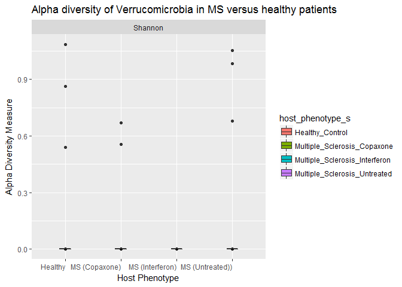

Final Report: Your Title Here
================
Emma Gibson
December 15, 2017

Introduction
============

In recent years, the human microbiome and its role and function in human health has become a popular topic of study and research. The microbes inside our gut have been linked to countless ailments and diseases, including many autoimmune disorders. (Clemente *et al.*, 2012) Although their purpose is complex and still not entirely understood, these gut microbes are known to play a role in training the immune system to recognize and attack potential pathogens both within the gut and throughout the rest of the body. (McDermott and Huffnagle, 2014; Lee and Mazmanian, 2010) Therefore, there is plentiful research being conducted on the role that these microbial communities can play immune system-related disorder both inside the digestive tract and in the body as a whole. A state of *dysbiosis*, or an abnormal gut microbiome, has already been correlated with numerous disorders, including diabetes, irritable bowel disorder, and rheumatoid arthritis. (Kostic *et al.*, 2014; Alkanani *et al.*, 2015; Scher *et al.*, 2013) In this analalysis, I chose to focus on the link between the gut microbiome and multiple sclerosis, another autoimmune disorder that has been linked to dysbiosis. (Cantarel *et al.*, 2015; Chen *et al.*, 2016)

Multiple sclerosis is an autoimmune disease that is defined by the boody's T-cells attackin the myelin coating of nerve cells, causing nerve damage. (Miranda-Hernandez and Baxter, 2013) Some studies have linked its development to environmental factors, such as sunlight exposure and diet. (Riccio *et al.*, 2010) There have also beenn numerous possible genetic markers found throughout the human genome. (Oksenberg *et al.*, 2008) Although multiple sclerosis is likely the result of numerous interacting environmental and genetic factors, the gut microbiome can act as an interface for all of these factors, leading to the development of the disease. (Ochoa-Repáraz and Kasper, 2014; Wang and Kasper, 2014) In evaluating the role that the gut microbiome plays in the development and treatment of diseases such as multiple sclerosis, it is important to note that correlation does not necesarily equal causation. However, a recent study by Berer *et al.* has demonstrated that gut microbes from multiple sclerosis patients can induce multiple sclerosis-like symptoms in transgenic mouse models. (Berer *et al.*, 2017) This indicates that the gut microbiome is not simply an indicator of multiple sclerosis, but plays a role it the development of the disorder as well.

In this analysis, I aim to discover the primary differences between gut microbiomes of multiple sclerosis patients and healthy patients, as well as the differences between different multiple sclerosis treatments.

Methods
=======

Study design
------------

The original study by Jangi *et al.* sampled the gut microbiome of 103 individuals, 60 multiple sclerosis patients and 43 healthy controls. (Jangi *et al.*, 2016) there were three variations of multiple sclerosis patients: those with untreated multiple sclerosis, those recieving treatment from beta-interferon, and those recieving treatment with glatiramer acetate. Both groups that had been recieving tratment had been doing so for at least 6 months. Both multiple sclerosis and control patients had no antibiotic use in the last 6 months, no probiotic use, no corticosteroids, np history of gastroenteritis, no irritable bowel syndrome, no bowel surgery, no bowel disease, no other autoimmune disease, were not pregnant, and had not traveled outside the country in the past month. All patients were also given a dietary survey before the collection of samples.

Sample origin and sequencing
----------------------------

To obtain microbiome data, Jangi *et al.* used stool samples that were collected by the patients and shipped to the laboratory overnight a 0 degrees Celcius. (Jangi *et al.*, 2016) Upon recieving the smples, they were stored at -80 degrees Celcius until DNA extaction, and were only subjected to one freeze-thaw cycle. They obtained sequence data from the fecal microbes using both pyrosequencing and Illumina sequencing of the 16S rRNA gene.

Computational
-------------

I processed and analyzed the sequence data using a combination of bash and R. First, I used bash to download and process the samples in order to determine their length and quality. For this analysis, I only used the pyrosequencing-derived sequences from the original study. Sequences of sufficient quality were then analyzed in R, using all of the relevant metadata and sequence information. R analyses were conducted through the usage of base R, as well as DADA2 and phyloseq. I made some additional analysis by exporting the fasta files derived from DADA2 into Geneious. (Kearse *et al.*, 2012) There, I used the FastTree plugin to constrict the phylogenetic tree that went into the phyloseq object. (Price *et al.*, 2009) Phyloseq was used to add various microbiome-specific functions to ggplot in order to better visualize the data (McMurdie and Holmes, 2013).

DADA2 was used for inter-sequence analysis and cleaning, such as forming OTUs and resolving minor sequence differences. The DADA2 pipeline begins with filtering paired fastq files by trimming them to a specific length and removing sequences that are too short, then further filtering based on number of expected errors, quality score, and number of ambiguous bases (Callahan *et al.*, 2016). Next, it can remove chimeras, which are sequences that are mare up of two parent sequences that result from sequencing errors. Lastly, it merges paired forward and reverse reads after all the sequences have been cleaned and de-noised, so that DADA2 can be extremely strict and require exact overlap.

Results
=======

``` r
# load all necesary libraries
library("dplyr")
```

    ## 
    ## Attaching package: 'dplyr'

    ## The following objects are masked from 'package:stats':
    ## 
    ##     filter, lag

    ## The following objects are masked from 'package:base':
    ## 
    ##     intersect, setdiff, setequal, union

``` r
library("tidyr")
library("knitr")
library("ggplot2")
library("vegan")
```

    ## Loading required package: permute

    ## Loading required package: lattice

    ## This is vegan 2.4-4

``` r
library("RColorBrewer")
library("citr")
library("seqinr")
```

    ## 
    ## Attaching package: 'seqinr'

    ## The following object is masked from 'package:permute':
    ## 
    ##     getType

    ## The following object is masked from 'package:dplyr':
    ## 
    ##     count

``` r
library("mctoolsr")
```

    ## You're using mctoolsr (v.0.1.1.1). Direct inquiries to:
    ## 'https://github.com/leffj/mctoolsr'

``` r
library("phyloseq")
```

    ## 
    ## Attaching package: 'phyloseq'

    ## The following object is masked from 'package:mctoolsr':
    ## 
    ##     plot_ordination

``` r
# load the output of the DADA2 script
load("output/phyloseq_obj.RData")
seq_table <- read.table("output/sequence_variants_table.txt",
                        row.names = 1,
                        header = TRUE)
metadata_in <- read.table(paste0("data/metadata/",
                                 "SraRunTable.txt"),
                          sep = "\t",
                          header = TRUE,
                          stringsAsFactors = FALSE,
                          row.names = 13)
# Melt phyloseq object to make certain analysis easier
melted_obj <- psmelt(phyloseq_obj)
```

Ovelall Community Analysis
--------------------------

``` r
# this finds Shannon diversity in all patients
plot_richness(phyloseq_obj,
              x = "host_phenotype_s",
              measures = c("Shannon")) +
  xlab("Host Disease Status") +
  geom_boxplot(aes(fill = host_phenotype_s),
               width = 0.2) +
  ggtitle("Alpha diversity in MS versus healthy patients")
```

    ## Warning in estimate_richness(physeq, split = TRUE, measures = measures): The data you have provided does not have
    ## any singletons. This is highly suspicious. Results of richness
    ## estimates (for example) are probably unreliable, or wrong, if you have already
    ## trimmed low-abundance taxa from the data.
    ## 
    ## We recommended that you find the un-trimmed data and retry.


**Figure 1.** Alpha diversity in patients by disease status

This figure shows Shannon diversity in healthy control patients and multiple sclerosis patients receiving each type of treatment. Diversity is relatively similar in all smaples regaurdless of multiple sclerosis status or treatment status. However, the multiple sclerosis groups consistently show a slight increase in diversity, especially in the Copaxone group.

**Table 1.** Phylum abindance in each

This table shows the abundance of each phylum in healthy patients and multiple sclerosis patients of each treatment type. Although the numbers are hard to compare between groups because the groups are of different sizes, there are consistencies in which bacterial phylums are the most and least common.

``` r
# this code gets the abundance of each phylum present in each patient type
phylum_totals <- melted_obj %>%
  filter(!is.na(Phylum)) %>%
  group_by(Phylum, host_phenotype_s) %>%
  tally() %>%
  spread(key = host_phenotype_s,
         value = n) %>%
  arrange(desc(Healthy_Control), desc(Multiple_Sclerosis_Interferon),
          desc(Multiple_Sclerosis_Copaxone), desc(Multiple_Sclerosis_Untreated))
kable(phylum_totals)
```

| Phylum                    |  Healthy\_Control|  Multiple\_Sclerosis\_Copaxone|  Multiple\_Sclerosis\_Interferon|  Multiple\_Sclerosis\_Untreated|
|:--------------------------|-----------------:|------------------------------:|--------------------------------:|-------------------------------:|
| Firmicutes                |            206668|                          65758|                            84546|                          136213|
| Bacteroidetes             |             50204|                          15974|                            20538|                           33089|
| Actinobacteria            |              9504|                           3024|                             3888|                            6264|
| Proteobacteria            |              9372|                           2982|                             3834|                            6177|
| Verrucomicrobia           |               836|                            266|                              342|                             551|
| Cyanobacteria/Chloroplast |               440|                            140|                              180|                             290|
| Synergistetes             |               264|                             84|                              108|                             174|
| Euryarchaeota             |               220|                             70|                               90|                             145|
| Fusobacteria              |                88|                             28|                               36|                              58|
| Lentisphaerae             |                44|                             14|                               18|                              29|
| Tenericutes               |                44|                             14|                               18|                              29|

**Table 2.** Number of patients of each treatment type

This table shows the number of patients in each treatment group. Each multiple sclerosis group is smaller on its own than the control group, and the different treatment groups are smaller than the untreated group.

``` r
# this code tells the number of patients with each disease type
melted_obj %>%
  group_by(host_phenotype_s) %>%
  summarise(number_of_patients = n_distinct(isolate_s))
```

    ## # A tibble: 4 x 2
    ##                host_phenotype_s number_of_patients
    ##                           <chr>              <int>
    ## 1               Healthy_Control                 43
    ## 2   Multiple_Sclerosis_Copaxone                 14
    ## 3 Multiple_Sclerosis_Interferon                 18
    ## 4  Multiple_Sclerosis_Untreated                 28

``` r
# this makes a stacked bar plot with phylum relative abundances
# for each type of patient
melted_obj %>%
  filter(!is.na(Phylum)) %>%
  group_by(host_phenotype_s, Phylum) %>%
  summarize(mean_abund = mean(Abundance)) %>%
  ggplot(aes(x = host_phenotype_s,
             y = mean_abund,
             fill = Phylum)) +
    geom_col(position = "fill",
             color = "black") +
  theme(axis.text.x = element_text(angle = 45, hjust = 1)) +
  ggtitle("A. Phylum abundance in MS vs healthy patients")
```


``` r
# this performs a similar analysis, but with standard deviation
melted_obj %>%
  filter(!is.na(Phylum)) %>%
  group_by(host_phenotype_s, Phylum) %>%
  summarize(sd_abund = sd(Abundance)) %>%
  ggplot(aes(x = host_phenotype_s,
             y = sd_abund,
             fill = Phylum)) +
    geom_col(position = "fill",
             color = "black") +
  #scale_x_discrete(labels = c("a", "b", "c", "d")) +
  theme(axis.text.x = element_text(angle = 45, hjust = 1)) +
  ggtitle("B. Phylum abundance standard deviation
          in MS vs healthy patients")
```


**Figure 2.** Normalized abundances of each phylum

This figure shows the normalized abundances of each phylum in each treatment group (A), and their respective standard deviations (B). Although there are several groups of bacteria that retain consistent relative abundance across all patient types, the Interferon-treated multiple sclerosis shows some major differences. Most notably, it contains considerably more Cyanobacteria and less Verrucomicrobia than the other patient groups.

``` r
# this code displays the phylogenetic tree from
# the GENEious analysis
plot_tree(phyloseq_obj,
          color = "host_phenotype_s",
          ladderize = TRUE) +
# the last line arranges the tree branches from short to long
  ggtitle("Phylogenetic tree colored by host disease type")
```


``` r
# you can use prune_taxa to look at trees for certain taxa
```

**Figure 3.** Phylogenetic tree colored by patient disease status

This figure shows a phylogenetic tree of all sequences in the dataset, with tips colored by patient disease status. At such a high resolution, there are no clear patterns or clades that emerge containing patients of one treatment status or another.

Firmicutes Phylum Analysis
--------------------------

**Table 3.** Common classes in Firmicutes bacteria

This table shows the abundances of each class within the Firmicutes phylum for multiple sclerosis patient sof all disease statuses. There is a considerable variety of classes within this phylum, but once again, the actual abundance numbers are skewed by their respective sample size.

``` r
# this subsets the bacteria in the Firmicutes phylum
# and finds the subsequent classes
firm_classes <- melted_obj %>%
  filter(Phylum == "Firmicutes") %>%
  filter(!is.na(Class)) %>%
  group_by(host_phenotype_s, Class) %>%
  tally() %>%
  spread(key = host_phenotype_s,
         value = n) %>%
  arrange(desc(Healthy_Control), desc(Multiple_Sclerosis_Interferon),
          desc(Multiple_Sclerosis_Copaxone), desc(Multiple_Sclerosis_Untreated))
# this prints the table in a markdown-friendly format
kable(firm_classes)
```

| Class            |  Healthy\_Control|  Multiple\_Sclerosis\_Copaxone|  Multiple\_Sclerosis\_Interferon|  Multiple\_Sclerosis\_Untreated|
|:-----------------|-----------------:|------------------------------:|--------------------------------:|-------------------------------:|
| Clostridia       |            176220|                          56070|                            72090|                          116145|
| Erysipelotrichia |             13068|                           4158|                             5346|                            8613|
| Bacilli          |              7700|                           2450|                             3150|                            5075|
| Negativicutes    |              6952|                           2212|                             2844|                            4582|

``` r
# This subsets the data to only include Firmicutes phylum
fir_subset <- subset_taxa(phyloseq_obj, Phylum == "Firmicutes")
# This finds the shannon diversity within this subset
plot_richness(fir_subset,
              x = "host_phenotype_s",
              measures = c("Shannon")) +
  xlab("Host Disease Status") +
  geom_boxplot(aes(fill = host_phenotype_s),
               width = 0.2) +
  ggtitle("Alpha diversity  of Firmicutes in MS versus healthy patients")
```

    ## Warning in estimate_richness(physeq, split = TRUE, measures = measures): The data you have provided does not have
    ## any singletons. This is highly suspicious. Results of richness
    ## estimates (for example) are probably unreliable, or wrong, if you have already
    ## trimmed low-abundance taxa from the data.
    ## 
    ## We recommended that you find the un-trimmed data and retry.


**Figure 4.** Shannon diversty in Firmicutes bacteria

This figure shows the Shannon diversity in all bacteria within the Firmicutes phylum for patients of all disease statuses. The diversity patterns within this phylum more or less reflect the diversity of the overall data.

``` r
# this makes a phylogenetic tree of the Firmicutes subset
plot_tree(fir_subset,
     color = "host_phenotype_s") +
  ggtitle("Phylogenetic tree colored by host disease type")
```


**Figure 5.** Phylogenetic tree of Firmicutes bacteria

This figure shows a phylogenetic tree of all sequences in the Firmicutes phylum, with tips colored by patient disease status. While there are several prominent clades, there are no clear patterns where one clade contains predominantly patients of a certain treatment or disease status.

Cyanobacteria Community Analysis
--------------------------------

**Table 4.** Common class in Cyanobacteria

This table shows that the only class in the Cyanobacteria phylum for multiple sclerosis patients of all disease statuses is Chloroplast.

``` r
# this subsets the bacteria in the Cyanobacteria phylum
# and identifies the sunsequent classes
cy_class <- melted_obj %>%
  filter(Phylum == "Cyanobacteria/Chloroplast") %>%
  group_by(host_phenotype_s, Class) %>%
  tally() %>%
  spread(key = host_phenotype_s,
         value = n) %>%
  arrange(desc(Healthy_Control), desc(Multiple_Sclerosis_Interferon),
          desc(Multiple_Sclerosis_Copaxone), desc(Multiple_Sclerosis_Untreated))
# this prints the above table in a markdown-friendly format
kable(cy_class)
```

| Class       |  Healthy\_Control|  Multiple\_Sclerosis\_Copaxone|  Multiple\_Sclerosis\_Interferon|  Multiple\_Sclerosis\_Untreated|
|:------------|-----------------:|------------------------------:|--------------------------------:|-------------------------------:|
| Chloroplast |               440|                            140|                              180|                             290|

``` r
# This subsets the bacteria in the Cyanobacteria phylum
cy_subset <- subset_taxa(phyloseq_obj, Phylum == "Cyanobacteria/Chloroplast")
# this plots the shannon diversity in said subset
plot_richness(cy_subset,
              x = "host_phenotype_s",
              measures = c("Shannon")) +
  xlab("Host Disease Status") +
  geom_boxplot(aes(fill = host_phenotype_s),
               width = 0.2) +
  ggtitle("Alpha diversity of Cyanobacteria in MS versus healthy patients")
```

    ## Warning in estimate_richness(physeq, split = TRUE, measures = measures): The data you have provided does not have
    ## any singletons. This is highly suspicious. Results of richness
    ## estimates (for example) are probably unreliable, or wrong, if you have already
    ## trimmed low-abundance taxa from the data.
    ## 
    ## We recommended that you find the un-trimmed data and retry.


**Figure 6.** Shannon diversty in Cyanobacteria

This figure shows the Shannon diversity in all bacteria within the Cyanobacteria phylum for patients of all disease statuses. There is almost no diversity in any of the samples, which is reflected in Table 4, that shows there is only one class within this phylum.

``` r
# This makes a phylogenetic tree of Cyanobacteria
plot_tree(cy_subset,
     color = "host_phenotype_s") +
  ggtitle("Phylogenetic tree colored by host disease type")
```


**Figure 7.** Phylogenetic tree of Cyanobacteria

This figure shows a phylogenetic tree of all sequences in the Cyanobacteria phylum, with tips colored by patient disease status. There are two major well-supported clades, one that contains primarily Cyanobacteria from healthy patients, and one that contains exclusively multiple sclerosis patients.

Verrucomicrobia Phylum Analysis
-------------------------------

**Table 5.** Common class, order, family, and genus in Verrucomicrobia bacteria

This table shows that all bacteria in the Verrucomicrobia phylum belong to the same class, order, family, and genus for multiple sclerosis patients of all disease statuses.

``` r
# this subsets the bacteria in the Verrucomicrobia phylum
# and identifies the sunsequent classes
ver_classes <- melted_obj %>%
  filter(Phylum == "Verrucomicrobia") %>%
  group_by(host_phenotype_s, Class, Order, Family, Genus) %>%
  tally() %>%
  spread(key = host_phenotype_s,
         value = n) %>%
  arrange(desc(Healthy_Control), desc(Multiple_Sclerosis_Interferon),
          desc(Multiple_Sclerosis_Copaxone), desc(Multiple_Sclerosis_Untreated))
# this puts the above information in a markdown-friendly format
kable(ver_classes)
```

| Class            | Order              | Family              | Genus       |  Healthy\_Control|  Multiple\_Sclerosis\_Copaxone|  Multiple\_Sclerosis\_Interferon|  Multiple\_Sclerosis\_Untreated|
|:-----------------|:-------------------|:--------------------|:------------|-----------------:|------------------------------:|--------------------------------:|-------------------------------:|
| Verrucomicrobiae | Verrucomicrobiales | Verrucomicrobiaceae | Akkermansia |               836|                            266|                              342|                             551|

``` r
# This subsets the bacteria in the Verrucomicrobia phylum
ver_subset <- subset_taxa(phyloseq_obj, Phylum == "Verrucomicrobia")
# this plots the shannon diversity of said subset
plot_richness(ver_subset,
              x = "host_phenotype_s",
              measures = c("Shannon")) +
  xlab("Host Disease Status") +
  geom_boxplot(aes(fill = host_phenotype_s),
               width = 0.2) +
  ggtitle("Alpha diversity of Verrucomicrobia in MS versus healthy patients")
```

    ## Warning in estimate_richness(physeq, split = TRUE, measures = measures): The data you have provided does not have
    ## any singletons. This is highly suspicious. Results of richness
    ## estimates (for example) are probably unreliable, or wrong, if you have already
    ## trimmed low-abundance taxa from the data.
    ## 
    ## We recommended that you find the un-trimmed data and retry.



**Figure 8.** Shannon diversty in Verrucomicrobia bacteria

This figure shows the Shannon diversity in all bacteria within the Verrucomicrobia phylum for patients of all disease statuses. There is almost no diversity in any of the samples, which is reflected in Table 5, that shows all of the bacteria in this phylum belongs to the same class, order, family, and genus.

``` r
# this makes a phylogenetic tree of bacteria in Verrucomicrobia
plot_tree(ver_subset,
     color = "host_phenotype_s") +
  ggtitle("Phylogenetic tree colored by host disease type")
```


**Figure 9.** Phylogenetic tree of Verrucomicrobia

This figure shows a phylogenetic tree of all sequences in the Verrucomicrobia phylum, with tips colored by patient disease status. All of the tips are very short, indicatin that there are no prominent clades within this phylum.

Discussion
==========

The differences in overall diversity between multiple sclerosis patients and the healthy controls were somewhat neglidgeable, althought all multiple sclerosis groups showed slightly higher diversity than the control patients. (Figure 1) The reason for this increased diversity is unclear based on my analysis, so further stuy would be needed to investigate this completely. One possible explanation could be that multiple sclerosis is cause by the presence of harmful bacteria, rather than the absence of beneficial ones. However, the correlation is not strong enough to draw any significant conclusions from. When looking at the overall abundance of each phylum in the patients, it is important to remember that the various sample sizes will influence the overall sum abundance. (Table 2) Keeping hat in mind, it is still apparent that the most common bacteria in multiple sclerosis patients are the same as those in healthy patients, such as the Firmicutes and Bacteriobetes phylums. GIven that these are generally considered the most common phylums in the human gut, this is not suprising. (Turnbaugh *et al.*, 2009) That said, there did appear to be significant differences in community composition between the control patients, as well as between patients recieving different treatment types. (Figure 2 A) Most notably, patients recieving Interferon treatment for their multiple sclerosis have a lower abundance of Verrucomicrobia and a higher abundance of Cyanobacteria. (Figure 2 A) This abundance of Cyanobacteria is particularly strange, because according to phyloseq, the Cyanobacteria in question all belong to the Chloroplast class. This raises the question of what chloroplasts were doing in the dark environment of the human intestine, and why Interferon apparently raised their abundance. This increased abundance is likely not an accident due to an outlier, because the standard deviation for Cyanobacteria abundance in Interferon patients is relatively similar to that of similarly abundant phylums. (Figure 2 B) Althougth he phylogenetic tree of the overall microbiome data shows numerous clades but no correlation between disease status and phylogeny, it is too large to draw any detained conclusions from. (Figure 3)

The first phylum I looked at in-depth was Firmicutes, because it had the highest abundance in control and all multiple sclerosis patients. (Table 1) Although there are many different species within this phylum present in the patients, there is no particular class, order, or family that is absent or present in one group of patients. (Table 3) This indicates that either the difference in Firmicutes microbiome content between multiple sclerosis and healthy patients is only apparent on the genus or species level, or there is no major difference for this phylum in multiple sclerosis patient's gut microbiomes. Based on my further analysis, I suspect that it is the latter, and the gut microbiome associated with multiple sclerosis is not determined by variiation within the Firmicutes class. In order to reach this conclusion, the next analysis I did was to find the Shannon diversity within the Firmicutes phylum. The analysis showed that the Shannon diversity within this phylum more or less mimicked the overall diversity for each patient type. (Figure 4) This makes sense, given that Firmicutes is the most common phylum and therefore likely accounts for most of the diversity in each patient type. The last analysis I used to determine this conclusion was the phylogenetic tree of only bacterium in the Firmicutes phylum. While there are several distinct clades in this phylogegetic tree, all of them appear to contain samples from patients in each disease type. (Figure 5) Given that Firmicutes is one of the most abundant phylums in the human gut, these findings seem to indicate that the Firmicutes bacteria present in multiple sclerosis patients' guts play the same basic role as those in a healthy person's gut. (Turnbaugh *et al.*, 2009) Therefore, it is likely that the bacteria that influence multiple sclerosis belong to another phylum.

The next phylum I looked at was Verrucomicrobia, because it was very abundant in every patient group except for the Interferon-treated multiple sclerosis patients. (Figure 2 A) Just like Cyanobacteria, there is sigificantly lower Shannon diversity in Verrucomicrobia in patients of every sample, which makse sense because it is also less common. (Figure 8) However, unlike Cyanobacteria, there does not appear to be a significant phylogenetic difference between Verrucomicrobia in multiple sclerosis and healthy patients. (Figure 9) The lack of diversity in this phylum both between and within multiple sclerosis patient sand healthy individuals indicates that it is likely not important to the development or treatment of multiple sclerosis. That said, the analysis I performed did not explain why its abundance appears to be so much lower in Interferon-treated multiple sclerosis patients than the other groups.

The last phylum I looked at in-depth was Cyanobacteria, because patients in the Interferon-treated multiple sclerosis group appeared to have a greater abundance of this phylum than the other groups. (Figure 2 A) I determined that this increase in abundance was not due to one outlying individual by looking at the standard deviations within this group, which was not considerably greater than the standard deviations of any other equally abundant phylums. (Figure 2 B) Interestingly, all of the Cyanobacteria appeared to be from the same class, Chloroplast. (Table 4) As one might expect from this information, the alpha diversity within this phylum was subsequently low among all individuals, including Interferon-treated multiple sclerosis patients. (Figure 6) That said, there is one outlier individual in the Interferon group with significantly higher alpha diversity. However, the area of analysis that shows the greatest difference between the Cyanobacteria in healthy and multiple sclerosis patients was the phylogenetic tree. This tree showed two main clades, one that pimarily contained Cyanobactaria from healthy patients and another that contained Cyanobacteria exclusively from multiple sclerosis patients. (Figure 7) This indicates that while there is little diversity in Cyanobacteria within patient groups, the Cyanobacteria found in multiple sclerosis patients appears to be genetically different than that in healthy patients. This indicates that there is a difference in the Cyanobacteria contents of gut microbiomes between multiple sclerosis and healthy patients, and possibly a connection between this phylum and the development or treatment of multiple sclerosis. One study links multiple sclerosis to a phage that is known to infect certain species of cyanobacteria. (Carter, 2012) Given this information, I think it would be interesting to perform a more in-deptht study on the Cyanobacteria in these patients' gut microbiomes, possibly looking for viral genetic markers or other, more Cyanobacteria-specific amplicons.

Sources Cited
=============

Alkanani,A.K. *et al.* (2015) Alterations in intestinal microbiota correlate with susceptibility to type 1 diabetes. *Diabetes*, **64**, 3510–3520.

Berer,K. *et al.* (2017) Gut microbiota from multiple sclerosis patients enables spontaneous autoimmune encephalomyelitis in mice. *Proceedings of the National Academy of Sciences*, 201711233.

Callahan,B.J. *et al.* (2016) DADA2: High-resolution sample inference from illumina amplicon data. *Nature Methods*, **13**, 581–583.

Cantarel,B. *et al.* (2015) Gut microbiota in multiple sclerosis: Possible influence of immunomodulators. *Journal of investigative medicine: the official publication of the American Federation for Clinical Research*, **63**, 729–734.

Carter,C. (2012) Epstein–Barr and other viral mimicry of autoantigens, myelin and vitamin d-related proteins and of eif2b, the cause of vanishing white matter disease: Massive mimicry of multiple sclerosis relevant proteins by the synechococcus phage. *Immunopharmacology and immunotoxicology*, **34**, 21–35.

Chen,J. *et al.* (2016) Multiple sclerosis patients have a distinct gut microbiota compared to healthy controls. *Scientific reports*, **6**, 28484.

Clemente,J.C. *et al.* (2012) The impact of the gut microbiota on human health: An integrative view. *Cell*, **148**, 1258–1270.

Jangi,S. *et al.* (2016) Alterations of the human gut microbiome in multiple sclerosis. *Nature communications*, **7**.

Kearse,M. *et al.* (2012) Geneious basic: An integrated and extendable desktop software platform for the organization and analysis of sequence data. *Bioinformatics*, **28**, 1647–1649.

Kostic,A.D. *et al.* (2014) The microbiome in inflammatory bowel disease: Current status and the future ahead. *Gastroenterology*, **146**, 1489–1499.

Lee,Y.K. and Mazmanian,S.K. (2010) Has the microbiota played a critical role in the evolution of the adaptive immune system? *Science*, **330**, 1768–1773.

McDermott,A.J. and Huffnagle,G.B. (2014) The microbiome and regulation of mucosal immunity. *Immunology*, **142**, 24–31.

McMurdie,P.J. and Holmes,S. (2013) Phyloseq: An r package for reproducible interactive analysis and graphics of microbiome census data. *PLoS ONE*, **8**, e61217.

Miranda-Hernandez,S. and Baxter,A.G. (2013) Role of toll-like receptors in multiple sclerosis. *American journal of clinical and experimental immunology*, **2**, 75.

Ochoa-Repáraz,J. and Kasper,L.H. (2014) Gut microbiome and the risk factors in central nervous system autoimmunity. *FEBS letters*, **588**, 4214–4222.

Oksenberg,J.R. *et al.* (2008) The genetics of multiple sclerosis: SNPs to pathways to pathogenesis. *Nature Reviews Genetics*, **9**, 516–526.

Price,M.N. *et al.* (2009) FastTree: Computing large minimum evolution trees with profiles instead of a distance matrix. *Molecular Biology and Evolution*, **26**, 1641–1650.

Riccio,P. *et al.* (2010) May diet and dietary supplements improve the wellness of multiple sclerosis patients? A molecular approach. *Autoimmune diseases*, **2010**.

Scher,J.U. *et al.* (2013) Expansion of intestinal prevotella copri correlates with enhanced susceptibility to arthritis. *Elife*, **2**, e01202.

Turnbaugh,P.J. *et al.* (2009) A core gut microbiome in obese and lean twins. *nature*, **457**, 480–484.

Wang,Y. and Kasper,L.H. (2014) The role of microbiome in central nervous system disorders. *Brain, Behavior, and Immunity*, **38**, 1–12.
